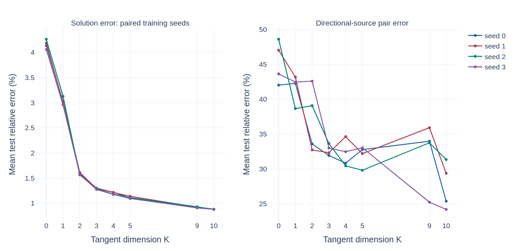
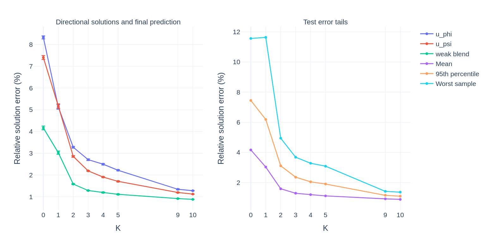
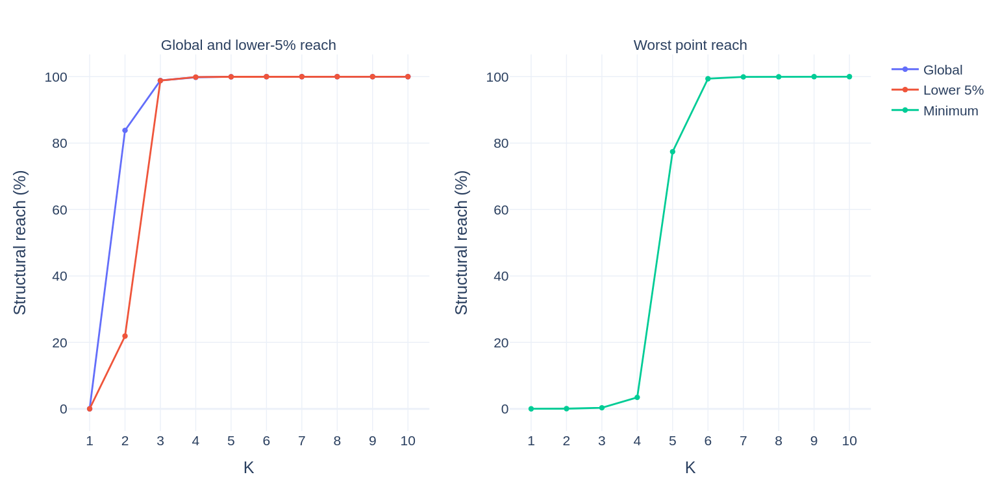
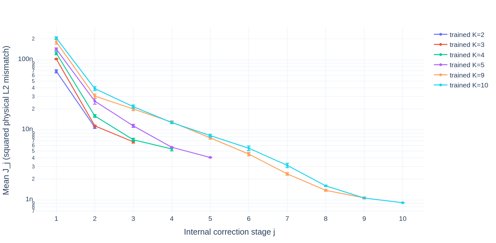
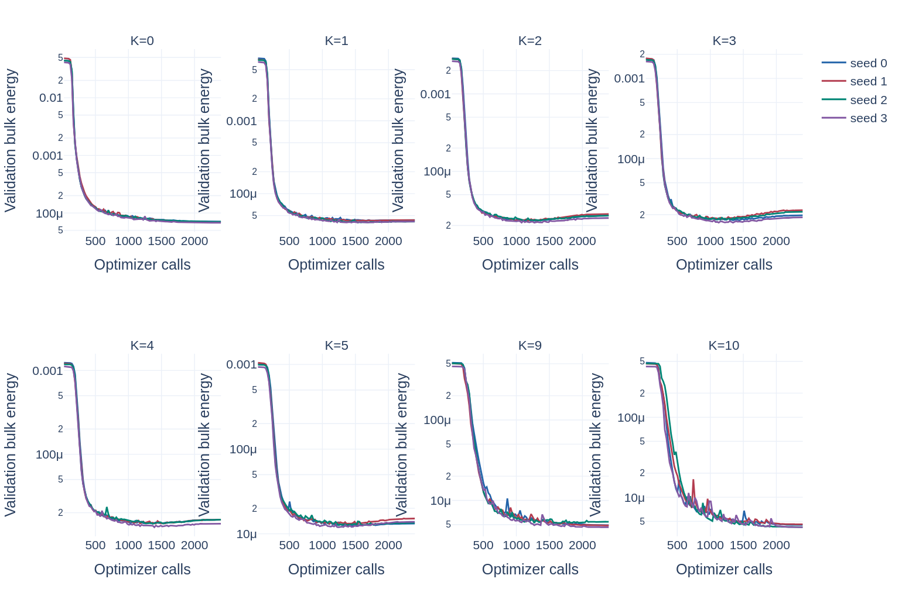
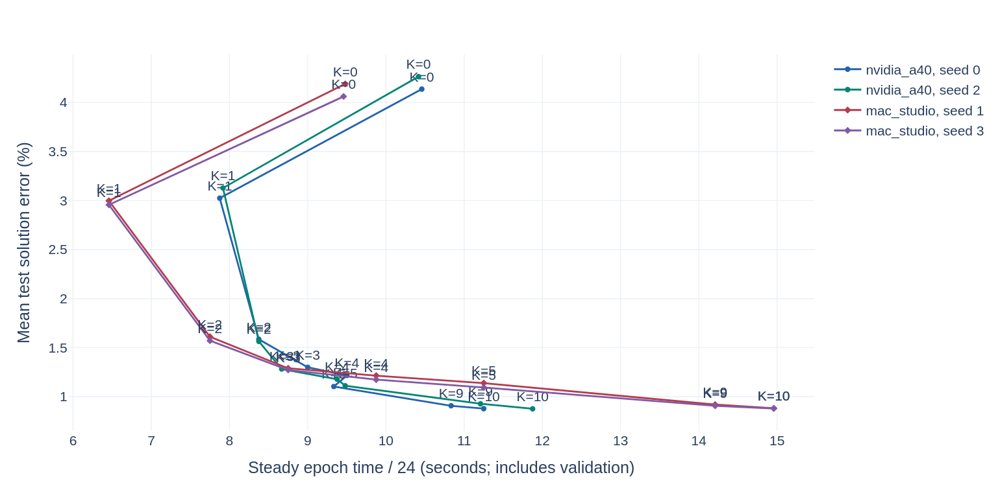
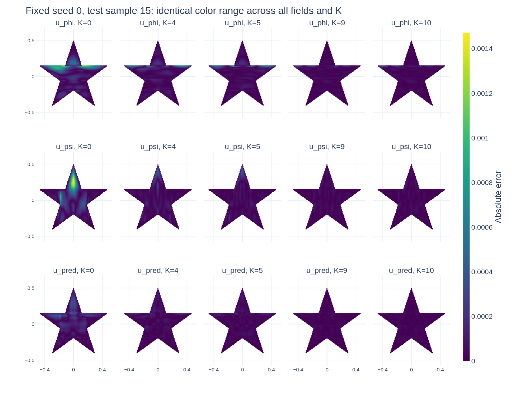

# Pentagram CDR: Four-Seed Tangent-Subspace Experiment

분석 시작: 2026-09-05, 완료: 2026-09-06. 대상은 NVIDIA A40와 Mac Studio에서 계산한 32개 학습이다. 원본 checkpoint, config, log, artifact는 수정하지 않았다. 이 문서는 논문을 위한 결과 해석과 그 해석의 한계를 함께 기록한다.

## 1. 결론

**고정된 C-trunk 모델에서 tangent subspace를 확장하면, 두 실행 환경에 분산된 네 seed 모두에서 solution의 평균 test 오차가 일관되게 감소한다.** K=0의 4.1627%에서 K=4의 1.1954%, K=9의 0.9148%, K=10의 0.8787%로 내려간다. 모든 K에서 학습 가능한 parameter 수는 1,482,872개로 같다. 따라서 이 실험에서 관찰한 차이를 신경망 parameter 증가로 설명할 수는 없다.

논문에서 가장 적절한 메시지는 다음과 같다.

1. **K=0에서 K=4:** geometry-only global/tail reach 99% 기준을 만족하는 크기만으로 큰 정확도 향상을 얻는다.
2. **K=4에서 K=9:** 극단적인 point를 포함한 full reach까지 확장하면 평균뿐 아니라 test error tail도 개선된다.
3. **K=9에서 K=10:** reach는 이미 100%지만 오차는 더 줄어든다. Structural coverage의 포화와 수치 최적화의 포화는 다르다.

K=10이 이번 고정-step 실험의 정확도 기준 최선이다. K=4는 비용을 절약하는 geometry-based 선택이고, K=9는 full-reach 해석의 기준점이다. 이 결과만으로 K=9를 수치적으로 최적이라고 주장하거나 K>10이 불필요하다고 주장할 수 없다.

전체 숫자는 [numerical_appendix.md](numerical_appendix.md), 재사용 가능한 집계는 [tables/aggregate_by_k.csv](tables/aggregate_by_k.csv), 32개 개별 실험은 [tables/run_metrics.csv](tables/run_metrics.csv)에 있다.

## 2. 비교의 유효성

### 실행 및 checkpoint

| 실행 환경 | Seed | K |
|---|---|---|
| NVIDIA A40, cuda:1 | 0, 2 | 0, 1, 2, 3, 4, 5, 9, 10 |
| Mac Studio, CPU | 1, 3 | 0, 1, 2, 3, 4, 5, 9, 10 |

모든 run에 100 epoch, 2400 cumulative optimizer calls, 100 validation events, best-energy artifact의 100 test sample이 있다. Parent `queue.log`에는 이전 실패 실행의 기록이 남아 있으므로 완료 여부나 소요시간의 근거로 사용하지 않았다. 개별 run의 log, 마지막 training step, test CSV, artifact summary를 서로 대조했다.

주 비교는 각 run의 `complex_coupling_model_best_energy.safetensors`를 export한 `artifacts_best_energy/metrics/per_sample_metrics.csv`이다. Run 바로 아래 `metrics/test_per_sample_metrics.csv`는 **final model**의 평가이므로 best-energy 결과와 섞지 않았다. 원본 artifact의 outdir에는 재실행 당시 디렉터리 이름이 남아 있으며, 현재 위치와 이 provenance를 모두 보존했다.

### 공통 조건

- Filled pentagram, outer radius 0.5, 중심 원점, 위쪽 tip, 중앙 pentagon 포함, hole 없음.
- h=1/128, 4572 interior active points, x-direction connected segment 142개, y-direction 147개.
- Fixed indexed GP: train 4800, validation 300, lengthscale 0.15, amplitude 1, mean 0.
- 공통 reference test 100개. Seed마다 training/global seed와 GP source seed가 함께 바뀌고, 같은 seed 내 모든 K에서는 동일하다.
- C-trunk: source/coefficient branch, concat branch fuser, primary 및 pointwise transverse trunk, concat trunk fuser. Geometry branch와 fixed-line transverse branch는 off. Pre-projection fuser도 off.
- Float64, trainable parameters 1,482,872개, frozen GreenNet 동일.
- SOAP, betas=(0.95,0.99), shampoo_beta=0.95, precondition_frequency=3, weight_decay=0.05, gradient clip=1.
- Batch=200, epochs=100, optimizer calls=2400, warmup_steps=240, cosine LR 0.002에서 0.00001, validation_every_steps=24. SOAP 첫 preconditioner 초기화 no-op도 step에 포함한다.
- Boundary weight=0, response-trust off, stationarity off, optimized objective는 bulk canonical energy 하나다.
- Local weak-residual reliability는 모든 run에서 on: gamma=0.5, smoothing_steps=2, relaxation=0.5, relative_floor=0.1. 이는 최종 reconstruction에 적용되며 training objective에는 들어가지 않는다.
- K=0은 physical symmetric projection만 사용한다. K=1은 uncapped exact line search이고, K>=2도 uncapped nested tangent subspace이다. K=1 safety cap이 결과 비교를 방해하는 예전 조건은 없다.
- Tangent preconditioner는 separable, relative_lambda=0.01. 이번 sweep은 explicit K이며 geometry 자동선택 기능을 사용한 실험은 아니다.

허용된 config 차이의 전체 목록은 [config_differences.json](config_differences.json)에 있다. Tangent sidecar가 있는 28개 run에서 geometry semantic hash, Green state-dict hash, point 수, dtype, physical point mass가 일치한다. X/Y Green branch의 byte hash는 하드웨어 그룹 간 다르므로 bitwise 동일 context라고 쓰지 않는다. 별도 CPU 재평가로 이것이 원래 test metric의 재현을 방해하는지 검사했다.

### PDE

\[
-\nabla\cdot(a\nabla u)+\mathbf b\cdot\nabla u+cu=f,
\qquad u|_{\partial\Omega}=0.
\]

R=0.5, xi=x/R, zeta=y/R에 대해

\[
a=1+\frac12\sin(\pi\xi)\sin(\pi\zeta),\quad
\mathbf b=\left(-\frac12\zeta,\frac12\xi\right),\quad
c=1+\frac12\cos(\pi\xi)\cos(\pi\zeta).
\]

a와 c는 [0.5,1.5] 안에 있으며 convection은 반시계 방향이다. 이는 `coefficients/CDR_pentagram.py`와 sample generation metadata를 기준으로 한 정의다. Axial operator의 반응항 c/2 분해는 유지된다.

## 3. Metric과 통계 정의

각 test sample b의 solution error는

\[
e_{u,b}=\frac{\|u_{\mathrm{pred},b}-u_{\mathrm{ref},b}\|_2}
{\|u_{\mathrm{ref},b}\|_2}.
\]

`rel_u_phi`, `rel_u_psi`는 같은 식의 prediction을 각각 u_phi, u_psi로 바꾼 값이다. 모든 norm은 같은 interior point에서 계산되며 균일한 hx*hy는 상대 norm에서 상쇄된다. Pointwise relative error를 평균한 값이 아니다.

`rel_flux`라는 기존 이름은 실제 flux vector a grad u의 오차가 아니다. 이 프로젝트에서는 **directional source pair**의 상대 오차다.

\[
e_{\phi,\psi,b}=\frac{\sqrt{\|\phi_b-\phi_{\mathrm{ref},b}\|_2^2+
\|\psi_b-\psi_{\mathrm{ref},b}\|_2^2}}
{\sqrt{\|\phi_{\mathrm{ref},b}\|_2^2+\|\psi_{\mathrm{ref},b}\|_2^2}}.
\]

각 seed에서 100 sample metric을 먼저 평균하고, 그 네 평균의 mean과 sample standard deviation(ddof=1)을 보고한다. 표의 +/-는 standard error나 confidence interval이 아니다. 100개 test sample은 모든 seed에서 공유되므로 400개 독립 test sample로 취급하지 않는다.

Training 및 best-energy selection은

\[
E_h(r)=h_xh_y\left[
\sum_{(i,j)\in E_x}\bar a_{ij}\left(\frac{r_j-r_i}{h_x}\right)^2+
\sum_{(i,j)\in E_y}\bar a_{ij}\left(\frac{r_j-r_i}{h_y}\right)^2\right],
\quad r=u_\phi-u_\psi
\]

의 batch/sample 평균을 사용한다. E_x,E_y는 geometry가 정의한 valid same-segment adjacency이고 bar a는 edge 양끝 diffusion의 평균이다. Boundary 항은 측정만 하며 가중치가 0이다. `loss_energy_consistency`는 bulk+boundary diagnostic이므로 이번 optimized `loss`와 같지 않다.

## 4. Test 정확도

| K | u_pred weak (%) | u_pred equal mean (%) | Source pair (%) | Test bulk energy | P95 solution (%) | Worst solution (%) |
|---:|---:|---:|---:|---:|---:|---:|
| 0 | 4.1627 +/- 0.0853 | 4.4519 | 45.3110 +/- 3.0183 | 6.76e-5 | 7.4451 | 11.5601 |
| 1 | 3.0264 +/- 0.0730 | 3.2174 | 41.6348 +/- 2.0277 | 4.02e-5 | 6.1837 | 11.6303 |
| 2 | 1.5824 +/- 0.0209 | 1.8516 | 36.9950 +/- 4.6699 | 2.18e-5 | 3.1090 | 4.9403 |
| 3 | 1.2856 +/- 0.0115 | 1.5491 | 32.7276 +/- 0.7523 | 1.64e-5 | 2.3529 | 3.6774 |
| 4 | 1.1954 +/- 0.0226 | 1.4437 | 32.1001 +/- 1.9088 | 1.38e-5 | 2.0433 | 3.2780 |
| 5 | 1.1113 +/- 0.0193 | 1.3255 | 31.9588 +/- 1.4709 | 1.19e-5 | 1.8992 | 3.0825 |
| 9 | 0.9148 +/- 0.0102 | 0.9919 | 32.2228 +/- 4.7523 | 4.57e-6 | 1.1495 | 1.4121 |
| 10 | 0.8787 +/- 0.0024 | 0.9515 | 27.5812 +/- 3.3501 | 4.10e-6 | 1.0914 | 1.3595 |

P95와 worst는 각 seed의 100 sample에서 계산한 값의 4-seed 평균이다. 가장 나쁜 한 run의 maximum이나 400행 전체의 quantile이 아니다.



K=0에서 K=4로 평균 solution error가 71.28% 감소하고, K=4에서 K=9로 23.47%, K=9에서 K=10으로 3.95% 감소한다. 네 seed 모두 같은 순서를 보인다.

다만 모든 sample에서 항상 좋아지는 것은 아니다. 같은 seed/sample을 대응시키면 K=4->5에서 개선되는 비율은 69.75%, K=4->9는 77.0%, K=9->10은 81.75%다. K=0->4는 전체 400쌍에서 개선된다. Tangent response cost의 단조성을 reference solution error의 sample별 단조성으로 해석해서는 안 된다.

### Directional Reconstruction과 Weak Blend

기존 CSV에 없는 u_phi/u_psi의 전체 test 오차는 32개 best-energy checkpoint를 CPU에서 재평가해 보완했다. 5개의 selected raw sample만으로 전체 평균을 추정하지 않았다. 수치는 수치 부록과 `tables/directional_test_samples.csv`에 있다.

| K | u_phi error (%) | u_psi error (%) |
|---:|---:|---:|
| 0 | 8.3259 +/- 0.0691 | 7.4003 +/- 0.0903 |
| 1 | 5.1298 +/- 0.1052 | 5.1692 +/- 0.1000 |
| 2 | 3.2757 +/- 0.0379 | 2.8533 +/- 0.0365 |
| 3 | 2.7042 +/- 0.0369 | 2.1892 +/- 0.0134 |
| 4 | 2.4960 +/- 0.0343 | 1.9040 +/- 0.0190 |
| 5 | 2.2177 +/- 0.0261 | 1.7067 +/- 0.0226 |
| 9 | 1.3435 +/- 0.0222 | 1.1947 +/- 0.0164 |
| 10 | 1.2775 +/- 0.0077 | 1.1231 +/- 0.0052 |

두 directional solution의 평균 오차도 네 seed 각각에서 K에 따라 단조롭게 감소한다. 따라서 final blend의 우연한 상쇄만으로 전체 개선을 설명할 수 없다. 다만 최종 u_pred의 오차는 개별 directional solution보다 작으므로 두 reconstruction을 조합하는 이점도 남아 있다.



Weak blend의 equal-mean 대비 평균 개선율은 K=0에서 약 6.50%, K=4에서 17.20%, K=9에서 7.76%, K=10에서 7.65%다. K>=2는 이번 전체 test sample에서 weak blend의 solution error가 equal mean보다 작다. K 증가의 효과는 equal-mean 열에도 명확하므로 weak weighting만으로 개선이 발생한 것은 아니다.

### Directional Source의 한계

Solution error와 달리 phi/psi pair의 오차는 단조롭지 않다. 예를 들어 K=5->9에서는 평균 31.96%에서 32.22%로 증가한다. K=9의 seed 간 변동도 크다. 따라서 논문에서는 solution과 directional reconstruction의 개선을 중심으로 서술하고, 모든 source component가 같은 비율로 개선되었다고 쓰지 않는다.

Reference target 자체에도 주의가 필요하다. 전체 100개 test NPZ에 대해

\[
\frac{\|f-\phi_{ref}-\psi_{ref}\|_2}{\|f\|_2}
\]

의 평균은 11.3859%, 최대는 21.2223%다. Model이 엄밀히 phi+psi=f를 만족한다면, 이 target에 대한 pair error에는 다음 하한이 존재한다.

\[
e_{\mathrm{pair},b}\ge
\frac{\|f_b-\phi_{ref,b}-\psi_{ref,b}\|_2}
{\sqrt{2}\,\|[\phi_{ref,b},\psi_{ref,b}]\|_2}.
\]

이 하한의 sample 평균은 6.5572%, 최대는 9.7887%다. 다만 K=10의 27.58%는 하한보다 충분히 크므로, 큰 source error 전체를 reference 오차로 설명할 수는 없다. Reference solution과 directional source의 FEM space 차수가 다른 생성 조건도 있으므로, 논문에서 source accuracy를 강한 결론에 사용하기 전에 reference 생성 정밀도를 별도로 점검해야 한다. 여기서는 target이나 metric을 바꾸지 않고 원래 target에 대한 결과를 보고한다.

## 5. Geometry Reach와 K

\[
C_{global}(K)=P^{-2}\sum_{i,j}\mathbf1[d_A(i,j)\le K-1],\quad
C_i(K)=P^{-1}\sum_j\mathbf1[d_A(i,j)\le K-1].
\]

이는 localized structural probe에 대한 reach이며, 학습된 dense gradient가 문자 그대로 이 범위에만 영향을 준다는 주장이 아니다. Geometry만으로 point graph를 재계산하면 A-graph diameter는 8이다.

| K | Global (%) | Lower-5% pointwise (%) | Minimum pointwise (%) | 解釈 |
|---:|---:|---:|---:|---|
| 0 | - | - | - | Tangent 없음. Reach의 K=0 확장은 정의하지 않음 |
| 1 | 0.021872 | 0.021872 | 0.021872 | 첫 방향 |
| 2 | 83.833420 | 21.916010 | 0.065617 | 대부분의 pair는 연결되지만 tail은 작음 |
| 3 | 98.852711 | 98.818898 | 0.328084 | Global/tail 모두 약 98.8% |
| 4 | 99.812794 | 99.868766 | 3.455818 | 두 99% 기준을 처음 만족 |
| 5 | 99.977822 | 99.956255 | 77.405949 | 가장 도달하기 어려운 point의 reach가 크게 증가 |
| 9 | 100 | 100 | 100 | 모든 pair의 full reach를 처음 만족 |
| 10 | 100 | 100 | 100 | Coverage는 증가하지 않음 |



K=4에서는 global/tail이 약 99.8%지만 minimum은 3.46%에 불과하다. Lower-5% criterion은 가장 극단적인 소수 point를 보장하지 않는다. K=5에서 minimum이 77.41%로 높아지는 것은 99% 대표값에 더해 minimum을 제시할 이유가 된다.

K=9와 K=10을 모두 싣는 의의는 100% coverage가 최소 오차를 보장하지 않음을 직접 보여줄 수 있다는 점이다. K=10은 coverage를 늘리지 않고도 남은 수치적 mode의 해소를 계속한다. 이번에 K=6,7,8의 retraining은 없으므로, K=5->9 개선을 각 중간 단계에 배분하거나 full reach 도달 순간에 오차가 급락한다고 단정할 수 없다.

이 geometry 지표는 계산 budget을 정하는 PDE-independent 사전 규칙으로 제시할 수 있다. 그러나 같은 geometry의 K sweep만으로는 reach의 영향을 K 증가에 따른 일반적인 subspace approximation 개선과 분리한 인과 효과로 식별한 것이 아니다.

## 6. Tangent Response Cost와 역할 분담

Symmetric-balanced proposal에서

\[
\phi_0=\tfrac12[f+(p-q)],\quad \psi_0=\tfrac12[f-(p-q)],\quad
m_0=H_x\phi_0-H_y\psi_0,\quad S=H_x+H_y
\]

로 두고 \(\phi=\phi_0+\delta_K,\psi=\psi_0-\delta_K\)를 구성한다. Balance는 보존된다. Nested tangent direction은 matrix-free response action과 response-MGS를 사용해 reference-free cost

\[
J_K=\|m_0+S\delta_K\|_{M}^{2},\qquad M=h_xh_yI
\]

를 감소시킨다. J에는 1/2을 붙이지 않는다. Training의 E_h는 gradient energy, J는 value mismatch의 제곱 L2 norm으로 서로 다른 양이다.

| K | Test mean final J | Correction/symmetric-pair norm (%) |
|---:|---:|---:|
| 1 | 2.9392e-8 | 6.3777 |
| 2 | 1.0933e-8 | 8.3729 |
| 3 | 6.7731e-9 | 10.5557 |
| 4 | 5.3620e-9 | 9.9713 |
| 5 | 4.0557e-9 | 11.3877 |
| 9 | 1.0716e-9 | 14.3755 |
| 10 | 9.1490e-10 | 13.6193 |

Correction norm은 \(\|[\delta,-\delta]\|_2/\|[\phi_0,\psi_0]\|_2\)이며 source accuracy가 아니다. K가 클수록 보정 전 proposal이 더 정확해지는 것은 아니다. 보정 전 mismatch RMS의 평균은 K=1에서 1.880e-3, K=9에서 3.333e-3지만 보정 후에는 각각 3.10e-4, 5.9e-5로 내려간다. 이는 신경망 단독으로 해를 완성하기보다 저차원 보정과 함께 최종 해를 만드는 역할 분담과 일치한다.



K>=2의 24개 checkpoint에 포함된 100 test sample에서 기록된 모든 direction이 active이며, 단계별 J는 허용 오차를 넘어 증가하지 않는다. K=10의 마지막 direction까지 실제로 사용한다. K=1은 별도로 cap 비활성 설정과 적용 eta를 확인한다.

K=10으로 학습한 network 내부에서 마지막 J10/J9의 seed 평균은 0.8568이며, 마지막 한 단계로 response cost가 약 14.32% 내려간다. K=9로 학습한 network의 J9/J8은 0.7789로 약 22.11% 내려간다. 다만 다른 trained K의 stage curve는 서로 다른 m0에서 출발하므로, 이를 하나의 frozen trajectory처럼 연결해서는 안 된다. 전체 stage의 cost, ratio, activity는 수치 부록과 `tables/tangent_stages.csv`에 있다.

## 7. Training 수렴과 Checkpoint 선택



| K | Best epoch 범위 | Final validation/best validation |
|---:|---:|---:|
| 0 | 93-100 | 1.0000-1.0013 |
| 1 | 59-69 | 1.0229-1.0407 |
| 2 | 47-54 | 1.1493-1.2184 |
| 3 | 44-56 | 1.1507-1.2840 |
| 4 | 57-64 | 1.0997-1.1235 |
| 5 | 52-63 | 1.0687-1.1621 |
| 9 | 68-100 | 1.0000-1.0379 |
| 10 | 98-100 | 1.0000-1.0014 |

K=2-5에서는 training energy가 내려가는 반면 후반 validation energy가 높아지는 경향이 있어 reference-free objective에 대한 generalization gap이 있다. Best-energy를 사용하는 의미가 크다. 반면 K=10은 끝까지 best가 갱신되므로 100 epoch에서 충분히 수렴했다고 단언하지 않는다.

Best-energy는 validation physics로 결정하며, test solution error를 보고 checkpoint를 선택하지 않는다. 실제 K=9 seed2에서는 final model의 test solution error가 best-energy model보다 작지만, 이를 이유로 주 비교를 final로 바꾸지 않는다.

이 실험은 동일한 2400 optimizer call budget에서의 비교다. 모든 조건의 최종 수렴 정확도 비교나 equal-wall-clock 비교가 아니다.

## 8. 계산 시간과 메모리

| K | A40 steady epoch (s) | Mac steady epoch (s) | A40 training span (h) | Mac training span (h) | A40 peak allocated (GiB) |
|---:|---:|---:|---:|---:|---:|
| 0 | 250.50 | 227.25 | 6.991 | 6.345 | 10.28 |
| 1 | 189.50 | 155.00 | 5.358 | 4.320 | 11.14 |
| 2 | 201.00 | 186.00 | 5.552 | 5.158 | 11.36 |
| 3 | 212.00 | 210.00 | 5.897 | 5.799 | 11.45 |
| 4 | 226.50 | 237.00 | 6.168 | 6.570 | 11.56 |
| 5 | 225.75 | 270.00 | 6.292 | 7.425 | 13.07 |
| 9 | 264.50 | 341.00 | 7.351 | 9.571 | 13.75 |
| 10 | 277.50 | 359.00 | 7.715 | 9.966 | 13.92 |

각 machine에 배정된 두 seed의 평균이다. Steady epoch는 run마다 epoch10->11부터 99->100까지 timestamp 차이의 median을 계산했다. 1 epoch는 24 optimizer calls지만 interval에 validation/checkpoint 등이 포함되므로 순수 forward/backward 시간이 아니다. Training span은 첫 run log부터 epoch100 train log까지로 setup/compile/validation을 포함하고, 이후 test/export는 제외한다.



K=4->9의 steady epoch 증가는 A40 약 16.8%, Mac 약 43.9%다. K=9->10은 각각 약 4.9%, 약 5.3%다. K=10은 K=9보다 소폭 늘어난 시간으로 solution error를 약 3.95% 줄이므로, 이번 구현에서 완전히 불필요한 계산이라고 할 수는 없다.

다만 다음을 명시해야 한다.

- **K=0의 경로 차이:** K>=1은 cached response block으로 reconstruction을 재사용하지만 K=0은 기존 Green reconstruction 경로를 사용한다. K=0이 K=1보다 느린 것은 이 구현 차이를 포함한다. Tangent의 수학적인 추가 cost가 음수라는 의미가 아니다.
- **동시 실행:** 각 machine에서 2개 학습을 동시에 실행하는 운영이며 A40에는 공유 GPU의 영향이 있다. GPU 점유율이나 MPS 50%의 실효 연산 시간은 저장 log만으로 검증할 수 없다. 단독 점유 hardware benchmark로 사용하지 않는다.
- **CPU threads:** Mac log에는 ACCELERATE/OMP/MKL 각 16, torch_num_threads=16, interop=1이 기록되어 있다. 이전 제안값 4와 다르다. 이번 CPU 재평가는 4 thread로 수행하며, 원래 training 시간과 별개다.
- **Memory:** A40 열은 각 run의 기록된 peak device allocated의 평균이며 GPU 전체 사용량이 아니다. Mac의 `optimizer_peak_memory_mib=0`은 CPU RSS를 측정하지 않았다는 뜻이지 memory cost가 0이라는 뜻이 아니다.
- **Optimizer timing:** `optimizer_step_time_mean_ms`는 SOAP step 부분만 측정한다. K에 따라 달라지는 forward/backward나 validation의 전체 비용을 대신하지 못한다.

## 9. 논문 구성안

### 본문에 포함할 내용

1. 동일 C-trunk, training budget, loss에서 K만 바꾸는 설계와 seed/hardware 배정.
2. K와 실제 global/lower-5%/minimum reach를 병기한 표. 99% 선택 K=4, full reach K=9, post-saturation K=10을 구분.
3. u_pred/u_phi/u_psi의 네 seed 평균과 표준편차, P95/worst의 표 또는 그림.
4. Hardware별 정확도-시간 curve. 시간 측정 범위와 shared-device 조건을 명시.
5. K=9와 K=10의 internal cost curve. Coverage가 포화된 후에도 response cost가 줄어듦을 설명.

### 보충자료에 포함할 내용

- 전체 32 run의 설정 감사, best epoch, test metric, training curve.
- 각 K의 전체 internal stage cost/ratio/activity.
- Weak와 equal mean 비교. Fixed checkpoint의 후처리 비교이지 weak 유무를 바꾼 retraining ablation은 아님.
- Reference directional-target balance 감사와 source-pair error에 대한 주의사항.
- 고정한 seed0/sample15의 동일 color range u_phi/u_psi/u_pred error map. K별로 대표 예제를 다시 선택하지 않으며, 한 sample 그림을 전체 test population의 tip-error 개선에 대한 증명으로 사용하지 않음.



### 주장의 범위

안전한 표현은 다음과 같다: geometry-based reach gives an interpretable structural budget; increasing the tangent dimension improves the accuracy-cost trade-off, with further numerical refinement possible after full structural reach.

피해야 할 표현은 99% reach가 99% solution accuracy를 보장한다, diameter로 최적 K가 증명되었다, K를 늘리면 각 sample/metric이 반드시 좋아진다, 같은 seed에서 A40와 Mac의 정확도 차이를 확인했다 등이다.

Seed0,2는 A40, seed1,3은 Mac에 고정되어 있으므로 seed 효과와 hardware 효과를 분리할 수 없다. 같은 seed 내 K 비교는 유효하지만 네 seed SD에는 hardware 차이도 포함될 수 있다. PyTorch 역시 CPU/GPU 간 완전한 재현성을 보장하지 않는다. [PyTorch reproducibility notes](https://docs.pytorch.org/docs/stable/notes/randomness.html)

## 10. 재현과 검증

분석은 저장된 metric을 우선하고, 부족한 directional solution metric만 best-energy checkpoint에서 보완한다. 장기 training, optimizer update, 원래 artifact의 재export는 수행하지 않았다.

```bash
PYTHONPATH=src OMP_NUM_THREADS=4 OPENBLAS_NUM_THREADS=4 \
~/.conda/envs/green_net/bin/python \
docs/analysis/pentagram_paper_20260905/analyze.py --replay
```

처음에는 32 checkpoint를 CPU에서 평가한다. `replay/*/metrics.csv`가 있으면 재사용하므로 다른 checkpoint로 바꾼 실험에 이 디렉터리를 전용하지 않는다. Input identity는 `input_manifest.json`과 `reference_manifest.json`에 기록했다.

CSV 집계와 summary의 일치, 100 sample ID 순서, 전체 validation step 열, loss=bulk, reference-free 설정, K=1 uncapped 설정, internal cost 비증가, geometry diameter/full reach, CPU 재평가와 원래 artifact의 rel_sol 일치를 검증한다. 모든 Plotly HTML은 같은 figures 디렉터리의 plotly.min.js로 offline 표시할 수 있다. 수치 집계 정의와 추가 표는 수치 부록을 참조한다.

전체 3200개 CPU 재평가의 원래 artifact 대비 rel_sol 최대 절대 차이는 1.846e-15, projection balance의 최대 절대 잔차는 6.218e-15였다. 따라서 원래 artifact와 다른 checkpoint나 다른 GreenNet을 불러와 방향별 metric을 보완한 정황은 없다. 이 검사는 inference 재현성 검사이며, 같은 seed로 CPU/GPU training을 반복했을 때의 동일성을 증명하는 검사는 아니다.
