## Hybrid Green's Function Learning With Axial Reduction {.title-slide}

<div class="title-kicker">WCCM-ECCOMAS 2026 | MS165 - Methods and Applications of Model Order Reduction</div>

<h1 class="title-main">Hybrid Green's Function Learning<br>With Axial Reduction</h1>

<p class="title-sub">A two-dimensional elliptic solver built from axial Green operators and a learned directional source split</p>

::: {.title-meta}
<p class="presenter">Junhong Jo</p>

<p class="affiliation"><strong class="nims-initial">N</strong>ational <strong class="nims-initial">I</strong>nstitute for <strong class="nims-initial">M</strong>athematical <strong class="nims-initial">S</strong>ciences</p>

<p>Joint work with Taeyoung Ha (NIMS) and Chang-Ock Lee (KAIST)</p>

<p>Tuesday, July 21, 2026</p>
:::

::: {.title-grid}
::: {.title-card}
<p class="label">Reduce</p>

a multi-dimensional elliptic problem into axial Green subproblems
:::

::: {.title-card}
<p class="label">Couple</p>

learn the directional source split that makes axial reconstructions consistent
:::

::: {.title-card}
<p class="label">Recover</p>

a multi-dimensional solution from coupled axial Green operators
:::
:::

::: {.notes}
**Target: 0:40 | Static slide**

Good afternoon. First, I would like to thank the organizers of this minisymposium for the opportunity to present this work. I am Junhong Jo from the National Institute for Mathematical Sciences. This is joint work with Taeyoung Ha at NIMS and Chang-Ock Lee at KAIST.

We solve multi-dimensional elliptic problems with two complementary components: GreenNet supplies line-wise Green inverses, and CouplingNet learns the directional source split that turns them into a two-dimensional solver. I will explain the construction and its numerical evidence.

**If timing is tight:** GreenNet provides line-wise inverses, while CouplingNet learns how to couple them.

**Transition:** Let me begin with the axial operator viewpoint.
:::

## Axial Reduction of Elliptic Operators {data-auto-animate=true}

<div class="slide-subtitle">Replace a global source-to-solution map with structured one-dimensional Green reconstructions</div>

::: {.compact-eq}
$$
\begin{aligned}
-\nabla\cdot(a\nabla u)+\mathbf b\cdot\nabla u+cu &= f
&&\text{in }\Omega,\\
u &= 0
&&\text{on }\partial\Omega,
\end{aligned}
\qquad
\mathbf b=(b_x,b_y).
$$
:::

::: {.note-box .strong}
$$
\mathcal S_{a,\mathbf b,c}: f\mapsto u,
\qquad
u=\mathcal S_{a,\mathbf b,c}[f].
$$

<p class="caption-note">Operator fixed; source varies.</p>
:::

::: {.fragment}
::: {.contrast-row}
::: {.problem-card}
<p class="label">Direct map</p>

one global source-to-solution representation

<p class="muted">High-dimensional and geometry-sensitive</p>
:::

::: {.arrow}
→
:::

::: {.problem-card .accent}
<p class="label">Reduced view</p>

directional 1-D operators + learned coupling

<p class="muted">line-wise inverses + learned source split</p>
:::
:::
:::

::: {.fragment}
::: {.split-operators}
$$
L_xu=-\partial_x(a\partial_xu)+b_x\partial_xu+\frac12cu,
\qquad
L_yu=-\partial_y(a\partial_yu)+b_y\partial_yu+\frac12cu.
$$

$$
L_xu+L_yu=f.
$$
:::
:::

::: {.fragment}
::: {.anchor-thesis}
GreenNet supplies line-wise Green inverses; CouplingNet learns the source split that turns them into a 2D elliptic solver.
:::
:::

::: {.notes}
**Target: 1:05 | Reveal the direct map, the directional split, and then the anchor sentence**

In our setting, the coefficient functions $a$, $\mathbf b$, and $c$ are prescribed, while the source $f$ varies across samples. Our learning target is therefore the source-to-solution map $f\mapsto u$.

**Click:** Representing this map directly over the full two-dimensional domain is high-dimensional and sensitive to geometry.

**Click:** We split the operator into $L_x$ and $L_y$, with half of the reaction term in each direction, so that $L_xu+L_yu=f$.

**Click:** GreenNet learns the directional line-wise inverses. CouplingNet learns how the source is divided between them. This is an operator and source decomposition, not merely a geometric slicing.

The homogeneous boundary condition is enforced within each directional line problem.

**If timing is tight:** We replace one global source-to-solution map with directional inverses and learned coupling.

**Transition:** This diagram summarizes the resulting solver.
:::

## From a 2D Elliptic Problem to Coupled Axial Green Solves

<div class="slide-subtitle">Graphic abstract: slice, solve line-wise, learn the coupling, reconstruct the field</div>

::: {.graphic-abstract-row}
::: {.graphic-stage .ga-problem .ga-compact}
<p class="label">2D forcing problem</p>
<svg class="ga-svg" viewBox="0 0 220 150" role="img" aria-label="Two-dimensional forcing on a general domain">
  <defs>
    <clipPath id="ga-source-domain-clip">
      <path d="M55 28 C84 8, 134 13, 158 39 C186 69, 170 118, 130 127 C88 138, 45 113, 35 78 C25 48, 34 36, 55 28 Z"/>
    </clipPath>
    <radialGradient id="ga-source-heat-a" cx="36%" cy="35%" r="70%">
      <stop offset="0%" stop-color="#fff3cc"/>
      <stop offset="42%" stop-color="#5fbfb7"/>
      <stop offset="100%" stop-color="#0a7c86"/>
    </radialGradient>
  </defs>
  <rect x="25" y="8" width="165" height="130" fill="url(#ga-source-heat-a)" clip-path="url(#ga-source-domain-clip)"/>
  <path d="M55 28 C84 8, 134 13, 158 39 C186 69, 170 118, 130 127 C88 138, 45 113, 35 78 C25 48, 34 36, 55 28 Z" fill="none" stroke="#172026" stroke-width="2.5"/>
  <text x="105" y="70" text-anchor="middle" class="ga-equation">Ω</text>
  <text x="105" y="143" text-anchor="middle">forcing f(x,y)</text>
</svg>
:::

::: {.graphic-arrow .fragment data-fragment-index="1"}
→
:::

::: {.graphic-stage .ga-slices .ga-wide .fragment data-fragment-index="1"}
<p class="label">Axial interval view</p>
<svg class="ga-svg" viewBox="0 0 220 150" role="img" aria-label="Axial intervals inside a general domain">
  <defs>
    <clipPath id="ga-slice-domain-clip">
      <path d="M55 28 C84 8, 134 13, 158 39 C186 69, 170 118, 130 127 C88 138, 45 113, 35 78 C25 48, 34 36, 55 28 Z"/>
    </clipPath>
  </defs>
  <path d="M55 28 C84 8, 134 13, 158 39 C186 69, 170 118, 130 127 C88 138, 45 113, 35 78 C25 48, 34 36, 55 28 Z" fill="#ffffff" stroke="#172026" stroke-width="2.5"/>
  <g clip-path="url(#ga-slice-domain-clip)">
    <line x1="20" y1="48" x2="190" y2="48" stroke="#2374d8" stroke-width="2.3"/>
    <line x1="20" y1="74" x2="190" y2="74" stroke="#2374d8" stroke-width="5"/>
    <line x1="20" y1="101" x2="190" y2="101" stroke="#2374d8" stroke-width="2.3"/>
    <line x1="69" y1="8" x2="69" y2="136" stroke="#d95f49" stroke-width="2.3"/>
    <line x1="104" y1="8" x2="104" y2="136" stroke="#d95f49" stroke-width="5"/>
    <line x1="139" y1="8" x2="139" y2="136" stroke="#d95f49" stroke-width="2.3"/>
  </g>
  <circle cx="104" cy="74" r="4.5" fill="#172026"/>
  <text x="104" y="143" text-anchor="middle" class="ga-small">axial intervals inside Ω</text>
</svg>
:::

::: {.graphic-arrow .fragment data-fragment-index="2"}
→
:::

::: {.graphic-stage .ga-green .fragment data-fragment-index="2"}
<p class="label">GreenNet: line-wise inverse</p>

::: {.ga-math-card .ga-green-math}
::: {.ga-math-kicker}
Kernel integration
:::

$$
v(t)=\int_0^1 G_\theta(t,\eta)\rho(\eta)\,d\eta
$$

::: {.ga-math-caption}
line source profile -> line solution
:::
:::
:::

::: {.graphic-arrow .fragment data-fragment-index="3"}
→
:::

::: {.graphic-stage .ga-solution .ga-wide .fragment data-fragment-index="3"}
<p class="label">CouplingNet: directional coupling</p>

::: {.ga-math-card .ga-coupling-math}
::: {.ga-math-kicker}
Source split couples line-wise inverses
:::

$$
f \xrightarrow{\mathrm{CouplingNet}}(\phi,\psi)
$$

$$
\phi+\psi=f
$$

$$
\phi\xrightarrow{G_x}u_\phi,
\qquad
\psi\xrightarrow{G_y}u_\psi
\Rightarrow u
$$
:::
:::
:::

::: {.fragment data-fragment-index="4"}
::: {.graphic-takeaway}
Axial GreenNet provides line-wise inverses; CouplingNet learns the directional source split that couples them into a 2D solution.
:::
:::

::: {.notes}
**Target: 0:50 | Reveal the roadmap from left to right**

Here is the complete pipeline. A two-dimensional source is restricted to valid horizontal and vertical intersections.

**Click:** Each connected interval in both directions becomes an independent one-dimensional line problem.

**Click: **GreenNet maps its line source to a line solution through a Green kernel integral.

**Click:** Those independent inverses still need a directional source allocation.

**Click:** CouplingNet predicts $\phi$ and $\psi$, routes them through the $x$- and $y$-direction Green reconstructions, and recovers a consistent two-dimensional solution.

**If timing is tight:** GreenNet solves along lines, and CouplingNet supplies the directional source allocation.

**Transition:** We first normalize every physical interval.
:::

## Unit-Interval Pull-Back and Operator Scaling {data-auto-animate=true}

<div class="slide-subtitle">Physical length is absorbed into normalized operator coefficient profiles and source profile</div>

::: {.two-panel}
::: {}
<p class="panel-title">Physical one-dimensional axial operator</p>

$$
\begin{aligned}
&s\in[s_0,s_1],\\
&\mathcal L_{\mathrm{phys}}u
=
-\frac{d}{ds}
\left(a_{\mathrm{phys}}(s)\frac{du}{ds}\right)
+
b_{\parallel,\mathrm{phys}}(s)\frac{du}{ds}
+
c_{\mathrm{phys}}(s)u
=
f_{\mathrm{phys}}(s).
\end{aligned}
$$
:::

::: {.interval-box}
<p class="panel-title">Normalize the coordinate</p>

::: {.interval-transform}
::: {.interval-stage .physical-stage}
<div class="interval-line">
  <span class="endpoint">s<sub>0</sub></span>
  <span class="track">
    <span class="length-label">L=s<sub>1</sub>-s<sub>0</sub></span>
    <span class="bar"></span>
  </span>
  <span class="endpoint">s<sub>1</sub></span>
</div>
:::

::: {.unit-stage .fragment .fade-up data-fragment-index="1"}
<div class="interval-arrow">pull back</div>
<div class="interval-line unit-interval-line">
  <span class="endpoint">0</span>
  <span class="track"><span class="bar"></span></span>
  <span class="endpoint">1</span>
</div>
:::
:::

::: {.center-eq .fragment .fade-up data-fragment-index="1"}
$$
s=s_0+Lt,\qquad v(t)=u(s_0+Lt),\qquad t\in[0,1].
$$
:::
:::
:::

::: {.fragment data-fragment-index="2"}
::: {.note-box .strong .pullback-length-note}
The interval is normalized, but the physical length is not discarded.
:::
:::

::: {.fragment data-fragment-index="3"}
::: {.equation-card .scaling-card}
$$
a_{\mathrm{unit}}=a_{\mathrm{phys}},
\quad
a'_{\mathrm{unit}}=L a'_{\mathrm{phys}},
\quad
b_{\parallel,\mathrm{unit}}=L b_{\parallel,\mathrm{phys}},
\quad
c_{\mathrm{unit}}=L^2c_{\mathrm{phys}},
\quad
f_{\mathrm{unit}}=L^2f_{\mathrm{phys}}.
$$
:::
:::

::: {.fragment data-fragment-index="4"}
::: {.equation-card .unit-equation-card}
$$
-\frac{d}{dt}
\left(
a_{\mathrm{unit}}(t)\frac{dv}{dt}
\right)
+
b_{\parallel,\mathrm{unit}}(t)\frac{dv}{dt}
+
c_{\mathrm{unit}}(t)v(t)
=
f_{\mathrm{unit}}(t),
\qquad
t\in[0,1].
$$
:::

::: {.small-note .slide3-b-note}
Here $b_\parallel=b_x$ on an $x$-directed interval and $b_\parallel=b_y$ on a $y$-directed interval.
:::
:::

::: {.notes}
**Target: 0:55 | Reveal the physical operator, pull-back, scaling rules, and normalized equation**

Axial intervals have different endpoints and physical lengths.

**Click:** We pull each coordinate $s$ back to $t\in[0,1]$ by $s=s_0+Lt$, and write the normalized solution as $v(t)=u(s_0+Lt)$.

**Click:** Normalization does not discard the length.

**Click**: Diffusion and convection scale with $L$, while reaction and source scale with $L^2$.

**Click:** The bottom equation is the same physical line problem on $[0,1]$, with its operator and boundary locations retained.

**If timing is tight:** Every interval becomes $[0,1]$, with its length retained through operator scaling.

**Transition:** On this normalized interval, GreenNet learns the inverse.
:::

## GreenNet I: Normalized Axial Green Operator {data-auto-animate=true}

<div class="slide-subtitle">Learn one-dimensional Green kernels, not a global two-dimensional kernel</div>

::: {.inverse-contrast .fragment}
<span>Previous step: normalize the operator.</span>
<strong>This step: learn its Green inverse.</strong>
:::

::: {.operator-action}
::: {.profile-card}
<p class="label">Source profile</p>
<div class="mini-plot source-plot"></div>

$f_{\mathrm{unit}}(\eta)$
:::

::: {.operator-stack}
::: {.operator-symbol}
$G_{\mathrm{unit}}(t,\eta)$
:::
<p class="operator-caption">kernel integral operator</p>
:::

::: {.profile-card}
<p class="label">Solution profile</p>
<div class="mini-plot solution-plot"></div>

$v(t)$
:::
:::

::: {.fragment}
::: {.equation-card}
$$
\mathcal G_{\mathrm{unit}}[f_{\mathrm{unit}}](t)
=
\int_0^1
G_{\mathrm{unit}}(t,\eta)
f_{\mathrm{unit}}(\eta)
\,d\eta,
\qquad
v=\mathcal G_{\mathrm{unit}}[f_{\mathrm{unit}}].
$$
:::
:::

::: {.fragment}
::: {.kernel-note}
**Operator coefficients**: Axial coefficient profiles define each local 1D operator.

**Kernel coordinates** $(t,\eta)$ define the evaluation and source points.

**GreenNet target** is a local unit-interval kernel, not a global 2D Green function.
:::
:::

::: {.notes}
**Target: 0:45 | Reveal the contrast strip and then the Green integral action**

**Click:** A Green operator maps a line source to a line solution by integrating against a kernel. GreenNet learns this action on the unit interval.

**Click:** It is not a global two-dimensional Green function.

**Click:** The axial coefficient profiles specify the local one-dimensional operator, while $t$ and $\eta$ are the evaluation and source coordinates.

GreenNet therefore learns a family of normalized axial kernels. The same model can be reused across the different axial intervals.

**If timing is tight:** GreenNet learns the unit-interval kernel integral for each axial operator.

**Transition:** We now build its singular structure into the model.
:::

## GreenNet II: Analytic Green Structure and Learned Correction {data-auto-animate=true}

<div class="slide-subtitle">A hybrid kernel: Dirac delta structure, Heaviside cancellation, and learned smooth correction</div>

::: {.inverse-contrast data-id="singularity-motivation"}
<strong>Do not learn the Green singularity from scratch.</strong>
:::

::: {.hybrid-thesis data-id="hybrid-thesis"}
<p class="label">Hybrid Green kernel</p>

$$
G_\theta
=
\text{Dirac delta structure}
+
\text{Heaviside cancellation}
+
\text{learned smooth correction}.
$$
:::

::: {.role-strip data-id="role-strip"}
::: {.role-pill .analytic}
<p class="label">Dirac delta structure</p>
<p>Build the source jump.</p>
:::

::: {.role-pill .cancel}
<p class="label">Heaviside cancellation</p>
<p>Cancel the induced Heaviside contribution.</p>
:::

::: {.role-pill .learned}
<p class="label">Learned smooth correction</p>
<p>Learn the smooth residual.</p>
:::
:::

::: {.hybrid-takeaway data-id="hybrid-takeaway"}
Analytic structure handles the singular terms before learning.
:::

::: {.notes}
**Slide 6, state 1 of 3 | About 0:25**

For variable coefficients, the exact kernel is rarely available, but its singularity, derivative jump, and homogeneous boundary behavior are known. We therefore build these features in analytically.

**Advance to the analytic identities.**
:::

## GreenNet II: Analytic Green Structure and Learned Correction {data-auto-animate=true}

<div class="slide-subtitle">A hybrid kernel: Dirac delta structure, Heaviside cancellation, and learned smooth correction</div>

::: {.big-equation .hybrid-formula data-id="hybrid-formula"}
$$
G_\theta(t,\eta)
=
\underbrace{\color{#9aa9aa}{E(t,\eta)M(t)R_\theta(t,\eta)}}_{\text{learned smooth correction}}
+
\underbrace{\color{#c9851e}{B(t)\left(J_0(t,\eta)-\frac12E(t,\eta)\right)}}_{\text{Heaviside cancellation}}
+
\underbrace{\color{#0a7c86}{A(t)G_0(t,\eta)}}_{\text{Dirac delta jump}}.
$$
:::

::: {.term-grid .analytic-focus data-id="analytic-terms"}
::: {.term-card .analytic}
<p class="label">Dirac delta structure</p>

$$
G_0(t,\eta)=
\begin{cases}
t(1-\eta), & t<\eta,\\
\eta(1-t), & t\ge\eta,
\end{cases}
\qquad
\partial_t^2G_0=-\delta(t-\eta).
$$
:::

::: {.term-card .cancel}
<p class="label">Heaviside cancellation</p>

$$
\partial_tJ_0(t,\eta)=G_0(t,\eta),
\quad
S=J_0-\frac12E,
\quad
\partial_t^2S=\partial_tG_0.
$$
:::
:::

::: {.hybrid-takeaway data-id="hybrid-takeaway"}
Analytic structure handles the singular terms before learning.
:::

::: {.notes}
**Slide 6, state 2 of 3 | About 0:30**

The $A(t)G_0$ term supplies the Dirac-delta jump. The variable-coefficient operator also produces a Heaviside-type contribution, cancelled by $B(t)(J_0-\frac12E)$, where $J_0$ is an antiderivative of $G_0$.

**Advance to the learned correction.**
:::

## GreenNet II: Analytic Green Structure and Learned Correction {data-auto-animate=true}

<div class="slide-subtitle">A hybrid kernel: Dirac delta structure, Heaviside cancellation, and learned smooth correction</div>

::: {.big-equation .hybrid-formula data-id="hybrid-formula"}
$$
G_\theta(t,\eta)
=
\underbrace{\color{#d85c46}{E(t,\eta)M(t)R_\theta(t,\eta)}}_{\text{learned smooth correction}}
+
\underbrace{\color{#9aa9aa}{B(t)\left(J_0(t,\eta)-\frac12E(t,\eta)\right)}}_{\text{Heaviside cancellation}}
+
\underbrace{\color{#9aa9aa}{A(t)G_0(t,\eta)}}_{\text{Dirac delta jump}}.
$$
:::

::: {.two-panel .learned-focus data-id="learned-focus"}
::: {.term-card .learned}
<p class="label">Learned smooth correction</p>

$$
E(t,\eta)M(t)R_\theta(t,\eta),
\qquad
E(t,\eta)=t\eta(1-\eta),
\qquad
M(t)=1-t.
$$
:::

::: {.note-box .learned-callout}
GreenNet learns $R_\theta$; $E(t,\eta)M(t)$ keeps that correction boundary-compatible. The singular and cancellation terms are already built into the kernel form.
:::
:::

::: {.hybrid-takeaway data-id="hybrid-takeaway"}
The neural network learns the smooth residual with boundary-compatible envelope factors.
:::

::: {.notes}
**Slide 6, state 3 of 3 | About 0:15**

The network learns only the remaining smooth correction $R_\theta$. Its envelope $E(t,\eta)M(t)$ makes that correction compatible with the endpoint conditions. Reaction effects also enter through this learned residual.

The nonsmooth Green behavior is supplied analytically, while learning is reserved for the smoother residual.

**If timing is tight:** Analytic terms handle the jump and cancellation; the network learns the boundary-compatible smooth residual.

**Transition:** The kernel is trained through its source-to-solution action.
:::

## GreenNet III: Source-to-Solution Supervision

<div class="slide-subtitle">Supervise the Green operator action, not pointwise exact-kernel labels</div>

::: {.note-box .muted-callout .supervision-contrast}
No pointwise Green-kernel labels.
:::

::: {.supervision-flow}
::: {.flow-node}
$w(t)\sim\mathcal{GP}(0,k_\ell)$
:::

::: {.flow-arrow}
→
:::

::: {.flow-node}
$v(t)=w(t)-((1-t)w(0)+t\,w(1))$

::: {.muted}
so $v(0)=v(1)=0$
:::
:::

::: {.flow-arrow}
→
:::

::: {.flow-node}
$f_{\mathrm{unit}}=\mathcal L_{\mathrm{unit}}v$
:::
:::

::: {.fragment}
::: {.equation-card}
$$
v_\theta(t)
=
\int_0^1
G_\theta(t,\eta)f_{\mathrm{unit}}(\eta)\,d\eta.
$$
:::
:::

::: {.fragment}
::: {.loss-card}
$$
\mathcal J_{\mathrm{Green}}
\sim
\mathbb E
\left[
\int_0^1
\left|v_\theta(t)-v(t)\right|^2\,dt
\right].
$$
:::
:::

::: {.fragment}
::: {.note-box .muted-callout}
Training checks whether the learned Green operator maps sources generated from target solutions back to those target solutions.
:::
:::

::: {.notes}
**Target: 0:50 | Reveal target generation, boundary enforcement, source generation, and reconstruction loss**

GreenNet is supervised through reconstruction, not exact-kernel labels. We sample a smooth Gaussian-process profile and remove its endpoint interpolant to obtain a Dirichlet target $v$. Applying the unit operator to $v$ generates a consistent source. Source and target are normalized by the same factor.

**Click:** GreenNet integrates that source against $G_\theta$,

**Click: ** and the loss compares the reconstruction $v_\theta$ with $v$.

**Click**: Every generated pair satisfies the same one-dimensional boundary-value problem, even though no exact kernel values are used as labels.

**If timing is tight:** Consistent source-solution pairs supervise the learned Green operator action.

**Transition:** We can now test whether the kernel structure was learned.
:::

## Numerical Evidence I: GreenNet Kernel Approximation {data-auto-animate=true}

<div class="slide-subtitle">Capturing the singular Green structure on an axial interval</div>

::: {.evidence-problem-strip .greennet-cd-problem data-id="greennet-cd-problem"}
$$
\Omega=\{x^2+y^2<0.5^2\},\quad
-\nabla\cdot(a\nabla u)+\mathbf b\cdot\nabla u=f,\quad c=0,
$$
$$
a(x,y)=1+\frac12\sin(2\pi x)\sin(2\pi y),\quad
\mathbf b(x,y)=
\left(
\frac12\sin(\pi x)\cos(\pi y),
-\frac12\cos(\pi x)\sin(\pi y)
\right).
$$
:::

::: {.evidence-line-context data-id="greennet-line-context"}
Axial line: y-directed interval at x = -0.25, L = 0.866.
:::

```{=html}
<div class="greennet-evidence-stage kernel-stage" data-id="greennet-evidence-stage">
  <div class="greennet-kernel-main">
    <div class="greennet-evidence-card kernel-card" data-id="reference-kernel">
      <p class="plot-card-title">Reference kernel</p>
      
    </div>
    <div class="greennet-evidence-card kernel-card" data-id="learned-kernel">
      <p class="plot-card-title">Learned kernel</p>
      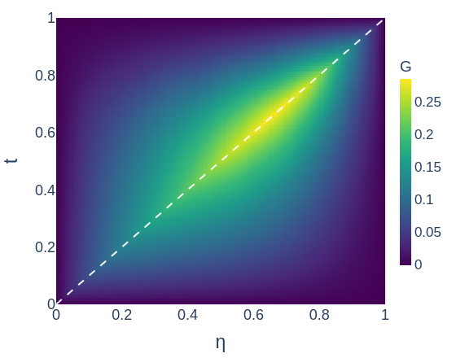
    </div>
  </div>
  <div class="greennet-evidence-side">
    <div class="greennet-evidence-card error-card" data-id="signed-error">
      <p class="plot-card-title">Signed error</p>
      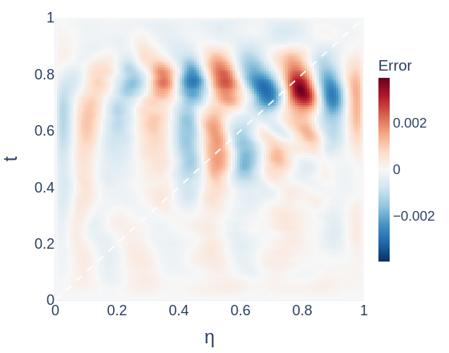
    </div>
    <div class="greennet-diagnostic-card compact" data-id="diagnostics">
      <p class="diagnostic-title">Diagnostics</p>
      <div class="diagnostic-row"><span>η</span><strong>0.75</strong></div>
      <div class="diagnostic-row"><span>Kernel rel. L2</span><strong>0.65%</strong></div>
      <div class="diagnostic-row"><span>Slice rel. L2</span><strong>0.46%</strong></div>
      <div class="diagnostic-row"><span>Diagonal band</span><strong>|t-η| ≤ 5/128 = 0.0391</strong></div>
      <div class="diagnostic-row"><span>Diagonal error mass / area</span><strong>11.8% / 8.3%</strong></div>
      <div class="diagnostic-row"><span>Diagonal mean / off-band mean</span><strong>1.47x</strong></div>
    </div>
  </div>
</div>
```

::: {.notes}
**Slide 8, state 1 of 3 | About 0:25**

This reaction-free convection-diffusion problem is used because its reference axial kernels are available. The displayed example is one representative vertical interval in the disk.

First, the reference and learned heatmaps show that GreenNet captures the singular diagonal structure.

**Advance to the fixed-$\eta$ slice.**
:::

## Numerical Evidence I: GreenNet Kernel Approximation {data-auto-animate=true}

<div class="slide-subtitle">Capturing the singular Green structure on an axial interval</div>

::: {.evidence-problem-strip .greennet-cd-problem data-id="greennet-cd-problem"}
$$
\Omega=\{x^2+y^2<0.5^2\},\quad
-\nabla\cdot(a\nabla u)+\mathbf b\cdot\nabla u=f,\quad c=0,
$$
$$
a(x,y)=1+\frac12\sin(2\pi x)\sin(2\pi y),\quad
\mathbf b(x,y)=
\left(
\frac12\sin(\pi x)\cos(\pi y),
-\frac12\cos(\pi x)\sin(\pi y)
\right).
$$
:::

::: {.evidence-line-context data-id="greennet-line-context"}
Axial line: y-directed interval at x = -0.25, L = 0.866.
:::

```{=html}
<div class="greennet-evidence-stage slice-stage" data-id="greennet-evidence-stage">
  <div class="greennet-slice-main">
    <div class="greennet-evidence-card slice-card-large" data-id="fixed-slice">
      <p class="plot-card-title">Fixed-<span class="keep-case">η</span> slice, <span class="keep-case">η</span>=0.75</p>
      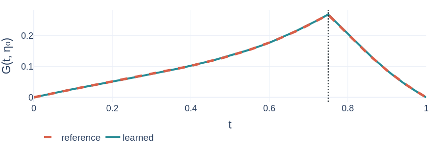
    </div>
  </div>
  <div class="greennet-evidence-side">
    <div class="greennet-evidence-card error-card" data-id="signed-error">
      <p class="plot-card-title">Signed error</p>
      
    </div>
    <div class="greennet-diagnostic-card compact" data-id="diagnostics">
      <p class="diagnostic-title">Diagnostics</p>
      <div class="diagnostic-row"><span>η</span><strong>0.75</strong></div>
      <div class="diagnostic-row"><span>Kernel rel. L2</span><strong>0.65%</strong></div>
      <div class="diagnostic-row"><span>Slice rel. L2</span><strong>0.46%</strong></div>
      <div class="diagnostic-row"><span>Diagonal band</span><strong>|t-η| ≤ 5/128 = 0.0391</strong></div>
      <div class="diagnostic-row"><span>Diagonal error mass / area</span><strong>11.8% / 8.3%</strong></div>
      <div class="diagnostic-row"><span>Diagonal mean / off-band mean</span><strong>1.47x</strong></div>
    </div>
  </div>
</div>
```

::: {.notes}
**Slide 8, state 2 of 3 | About 0:15**

Next, the fixed-$\eta$ slice shows that the two curves nearly overlap, including near the singular point.

**Advance to the takeaway.**
:::

## Numerical Evidence I: GreenNet Kernel Approximation {data-auto-animate=true}

<div class="slide-subtitle">Capturing the singular Green structure on an axial interval</div>

::: {.evidence-problem-strip .greennet-cd-problem data-id="greennet-cd-problem"}
$$
\Omega=\{x^2+y^2<0.5^2\},\quad
-\nabla\cdot(a\nabla u)+\mathbf b\cdot\nabla u=f,\quad c=0,
$$
$$
a(x,y)=1+\frac12\sin(2\pi x)\sin(2\pi y),\quad
\mathbf b(x,y)=
\left(
\frac12\sin(\pi x)\cos(\pi y),
-\frac12\cos(\pi x)\sin(\pi y)
\right).
$$
:::

::: {.evidence-line-context data-id="greennet-line-context"}
Axial line: y-directed interval at x = -0.25, L = 0.866.
:::

```{=html}
<div class="greennet-evidence-stage slice-stage takeaway-state" data-id="greennet-evidence-stage">
  <div class="greennet-slice-main">
    <div class="greennet-evidence-card slice-card-large" data-id="fixed-slice">
      <p class="plot-card-title">Fixed-<span class="keep-case">η</span> slice, <span class="keep-case">η</span>=0.75</p>
      
    </div>
  </div>
  <div class="greennet-evidence-side">
    <div class="greennet-evidence-card error-card" data-id="signed-error">
      <p class="plot-card-title">Signed error</p>
      
    </div>
    <div class="greennet-diagnostic-card compact" data-id="diagnostics">
      <p class="diagnostic-title">Diagnostics</p>
      <div class="diagnostic-row"><span>η</span><strong>0.75</strong></div>
      <div class="diagnostic-row"><span>Kernel rel. L2</span><strong>0.65%</strong></div>
      <div class="diagnostic-row"><span>Slice rel. L2</span><strong>0.46%</strong></div>
      <div class="diagnostic-row"><span>Diagonal band</span><strong>|t-η| ≤ 5/128 = 0.0391</strong></div>
      <div class="diagnostic-row"><span>Diagonal error mass / area</span><strong>11.8% / 8.3%</strong></div>
      <div class="diagnostic-row"><span>Diagonal mean / off-band mean</span><strong>1.47x</strong></div>
    </div>
  </div>
</div>
```

::: {.evidence-takeaway .greennet-takeaway data-id="greennet-takeaway"}
The learned kernel captures the singular Green structure, and the signed error is not concentrated near the singular diagonal.
:::

::: {.notes}
**Slide 8, state 3 of 3 | About 0:15**

Finally, the signed-error heatmap and diagnostics show that error is not concentrated only near the diagonal. This indicates that the analytic wrapping has handled the singular structure as intended.

**If timing is tight:** The learned kernel captures the singular structure without diagonal-dominated error.

**Transition:** We now need to couple these line-wise inverses.
:::

## CouplingNet I: Directional Source Split

<div class="slide-subtitle">Learn how the forcing is divided between axial Green reconstructions</div>

::: {.split-question .split-question-compact}
::: {.ghost-inverse}
$G_x[\cdot]$
:::

::: {.question-box}
full source $f$

<p class="big-symbol">?</p>
:::

::: {.ghost-inverse}
$G_y[\cdot]$
:::
:::

::: {.fragment}
::: {.equation-card}
$$
f \longmapsto (\phi,\psi).
$$
:::
:::

::: {.fragment}
::: {.directional-source-definitions}
::: {.split-definition .x-source}
<p class="label">x-directed source</p>

$$
\phi=L_xu,
\qquad
L_xu=
-\partial_x(a\partial_xu)
+b_x\partial_xu
+\tfrac12cu.
$$
:::

::: {.split-definition .y-source}
<p class="label">y-directed source</p>

$$
\psi=L_yu,
\qquad
L_yu=
-\partial_y(a\partial_yu)
+b_y\partial_yu
+\tfrac12cu.
$$
:::
:::
:::

::: {.fragment}
::: {.equation-card .balance-strip}
$$
\phi+\psi=f.
$$
:::
:::

::: {.fragment}
<p class="takeaway-line compact-takeaway">CouplingNet learns line-wise flux-divergence/source components that couple the axial Green reconstructions.</p>
:::

::: {.notes}
**Target: 0:50 | Reveal the need for coupling, the directional components, and then balance**

GreenNet provides the directional inverses, but it does not determine how the two-dimensional source is split into the $x$- and $y$-directional source components.

**Click:** CouplingNet predicts $\phi$ and $\psi$, the horizontal and vertical flux-divergence or source components.

**Click:** With the reaction term divided equally,

**Click:** their physical balance is $\phi+\psi=f$.

**Click:** CouplingNet predicts this split rather than the solution itself.

Training uses neither reference-solution nor split labels. It is driven by balance, Green reconstruction, and split consistency; reference solutions are used only for evaluation.

**If timing is tight:** CouplingNet learns the balanced directional source components, not the solution.

**Transition:** Its inputs combine line profiles with pointwise coordinates.
:::

## CouplingNet II: Branches and Local Context for Split Prediction {data-auto-animate=true}

<div class="slide-subtitle">Branch nets encode profiles; trunk nets encode pointwise coordinates</div>

::: {.coupling-architecture}
::: {.arch-group .branch-group .fragment}
<p class="group-label">Branch nets</p>

::: {.arch-card}
<p class="label">Source profile</p>

<p>sample-varying forcing profile</p>
:::

::: {.arch-card}
<p class="label">Coefficient profiles</p>

<p>diffusion, primary/transverse convection, reaction</p>
:::

::: {.arch-card}
<p class="label">Line-geometry structure</p>

<p>interval length, endpoints, transverse placement</p>
:::
:::

::: {.arch-center}
<p class="predictor-label">Split predictor</p>

$$
(\text{branch features},\ \text{trunk features})
\longrightarrow
(\phi,\psi)
$$
:::

::: {.arch-group .trunk-group .fragment}
<p class="group-label">Trunk nets</p>

::: {.arch-card}
<p class="label">Axial local trunk</p>

$t_{\parallel}$: position along the primary interval
:::

::: {.arch-card}
<p class="label">Pointwise transverse trunk</p>

$t_{\perp}$: position on the transverse interval through this point
:::
:::
:::

::: {.fragment}
::: {.architecture-takeaway}
$$
\underbrace{\text{profiles and line geometry}}_{\text{branch nets}}
\quad+\quad
\underbrace{\text{pointwise coordinates}}_{\text{trunk nets}}
\quad\Rightarrow\quad
\text{directional source split}.
$$
:::
:::

::: {.notes}
**Target: 0:50 | Reveal the predictor, branch nets, trunk nets, and combined map**

CouplingNet separates profile-level and pointwise information.

**Click:** The branch nets encode the source, axial coefficient profiles, and line geometry. Although the coefficients are fixed for the problem, their profiles differ across lines.

**Click:** The trunk nets encode the pointwise positions within the primary and transverse axial intervals.

**Click:** Combining both representations at each point produces the directional split.

**If timing is tight:** Branches encode line profiles; trunks encode axial and transverse coordinates.

**Transition:** The predicted split is then balanced and reconstructed.
:::

## CouplingNet III: Projection and Green Reconstruction {data-auto-animate=true}

<div class="slide-subtitle">Project in physical split variables, then reconstruct and average</div>

::: {.solver-pipeline}
::: {.projection-stage}
<p class="stage-label">Stage 1: physical balance projection</p>

::: {.stage-flow}
::: {.solver-card .raw-card .fragment data-fragment-index="1"}
<p class="label">CouplingNet raw split</p>

$$
(\phi_{\mathrm{raw}},\psi_{\mathrm{raw}})
$$

<p>not guaranteed balanced</p>
:::

::: {.solver-arrow .fragment data-fragment-index="2"}
→
:::

::: {.solver-card .projection-card .fragment data-fragment-index="2"}
<p class="label">Projection step</p>

$$
r=f-(\phi_{\mathrm{raw}}+\psi_{\mathrm{raw}})
$$

$$
\phi=\phi_{\mathrm{raw}}+\frac12r,
\qquad
\psi=\psi_{\mathrm{raw}}+\frac12r
$$
:::

::: {.solver-arrow .fragment data-fragment-index="3"}
→
:::

::: {.solver-card .balanced-card .fragment data-fragment-index="3"}
<p class="label">Balanced split</p>

$$
\phi+\psi=f
$$
:::
:::
:::

::: {.reconstruction-stage .fragment data-fragment-index="4"}
<p class="stage-label">Stage 2: Green reconstruction</p>

::: {.reconstruction-grid}
::: {.solver-card}
<p class="label">x-represented solution</p>

$$
u_\phi=G_x[\phi]
$$
:::

::: {.solver-card}
<p class="label">y-represented solution</p>

$$
u_\psi=G_y[\psi]
$$
:::

::: {.solver-card .final-average-card}
<p class="label">Final average</p>

$$
u_{\mathrm{pred}}=\frac12(u_\phi+u_\psi)
$$
:::
:::
:::

::: {.fragment data-fragment-index="5"}
::: {.solver-takeaway}
$$
(\phi_{\mathrm{raw}},\psi_{\mathrm{raw}})
\xrightarrow{\text{projection}}
(\phi,\psi),\ \phi+\psi=f
\xrightarrow{G_x,G_y}
(u_\phi,u_\psi)
\xrightarrow{\text{average}}
u_{\mathrm{pred}}.
$$
:::
:::
:::

::: {.notes}
**Target: 0:50 | Reveal the raw split, projection, balanced split, Green reconstructions, and average**

GreenNet evaluates each axial inverse on the normalized unit interval. CouplingNet, however, must enforce the directional source balance in the original physical coordinates. The raw source components are therefore restored to the physical source scale before projection.

**Click:** The raw split need not satisfy $\phi+\psi=f$.

**Click:** We form
$$
r=f-(\phi_{\mathrm{raw}}+\psi_{\mathrm{raw}})
$$
and add half of $r$ to each component.

**Click:** This gives a balanced split satisfying $\phi+\psi=f$.

**Click:** The balanced components are then pulled back along their respective axial intervals and passed through $G_x$ and $G_y$, producing $u_\phi$ and $u_\psi$. Their average,
$$
\frac12(u_\phi+u_\psi),
$$
is the final prediction.

**Click:** The projection preserves the original source exactly while changing only its directional decomposition.

**If timing is tight:** GreenNet solves on normalized intervals, while projection enforces the source balance in physical coordinates before reconstruction.

**Transition:** Their agreement yields an energy-error interpretation.
:::

## Energy-Norm Error Bound Proposition

<div class="slide-subtitle">Small split energy controls the final energy error</div>

::: {.energy-diagram}
::: {.solution-node}
$u_\phi$
:::

::: {.solution-node .focus}
$u_{\mathrm{pred}}=\frac12(u_\phi+u_\psi)$
:::

::: {.solution-node}
$u_\psi$
:::
:::

::: {.fragment data-fragment-index="1"}
::: {.equation-card .energy-norm-card}
<p class="label">Diffusion-weighted energy norm</p>

$$
\|v\|_a^2
:=
\int_\Omega a(x)|\nabla v(x)|^2\,dx,
\qquad
a(x)>0.
$$

::: {.mini-note}
Here $a(x)$ is the diffusion coefficient.
:::
:::
:::

::: {.energy-definition-grid}
::: {.fragment data-fragment-index="2"}
::: {.equation-card .split-energy-card}
<p class="label">Split-energy loss</p>

$$
\mathcal{E}_{\mathrm{split}}=\|u_\phi-u_\psi\|_a^2.
$$
:::
:::

::: {.fragment data-fragment-index="3"}
::: {.equation-card .reference-card}
<p class="label">Reference solution</p>

$$
\mathcal L u_*=f,
\qquad
u_*|_{\partial\Omega}=0.
$$
:::
:::
:::

::: {.fragment data-fragment-index="4"}
::: {.bound-card .energy-bound-card}
$$
\|u_{\mathrm{pred}}-u_*\|_a
\le
\frac{C_E}{2}
\sqrt{\mathcal{E}_{\mathrm{split}}}.
$$

::: {.constant-note}
$C_E$: stability constant of the fixed elliptic operator.
:::
:::
:::

::: {.assumption-footer .energy-assumption-strip .fragment data-fragment-index="5"}
Conditional on exact/controlled Green reconstruction and $H_0^1(\Omega)$-admissible represented solutions.
:::

::: {.notes}
**Target: 1:05 | Introduce the unsupervised loss, then reveal the norm, split energy, reference solution, bound, and assumptions**

CouplingNet is trained without reference-solution or directional-split labels. We therefore need a loss that can be computed from the two directional reconstructions alone.

**Click:** Since $u_\phi$ and $u_\psi$ are intended to represent the same physical solution, we measure their disagreement in the diffusion-weighted energy norm. Here, $a$ is the diffusion coefficient, and this norm captures gradient-level differences in the PDE scale.

**Click:** This gives the unsupervised split-energy loss,
$$
\mathcal E_{\mathrm{split}}
=
\|u_\phi-u_\psi\|_a^2.
$$

**Click:** For the theoretical analysis, let $u_*$ denote the exact reference solution. It does not enter the CouplingNet training loss.

**Click:** Why is this loss relevant to solution accuracy? Under the stated assumptions, it bounds the final energy error through the inequality shown here. The constant $C_E$ is a stability constant of the elliptic operator.

**Click:** This result is conditional on $H_0^1(\Omega)$ admissibility and exact or controlled Green reconstruction. It provides a structural justification for the unsupervised loss, rather than an unconditional guarantee.

**If timing is tight:** CouplingNet minimizes the energy disagreement between its two reconstructions. Under controlled Green reconstruction, this unsupervised loss bounds the final energy error.

**Transition:** We now evaluate the complete coupled solver.
:::

## Numerical Evidence II: CouplingNet Solution Reconstruction

<div class="slide-subtitle">Quantile-selected samples show source, reference, prediction, and signed error</div>

::: {.evidence-problem-strip .coupling-problem-strip}
$$
\begin{aligned}
\Omega=\{x^2+y^2<0.5^2\},\qquad
&-\nabla\cdot(a\nabla u)+\mathbf b\cdot\nabla u+c u=f,\\
a=1+\frac12\sin(2\pi x)\sin(2\pi y),\qquad
&\mathbf b=
\left(
\frac12\sin(\pi x)\cos(\pi y),
-\frac12\cos(\pi x)\sin(\pi y)
\right),\quad
c=\frac12\left(1+\frac12\cos(2\pi x)\cos(2\pi y)\right).
\end{aligned}
$$
:::

```{=html}
<div class="coupling-evidence-layout">
  <div class="coupling-evidence-grid" aria-label="CouplingNet field comparison across rel. solution error quantiles.">
    <div></div>
    <div class="coupling-col-label"><p>min</p><span>rel. sol. err.</span></div>
    <div class="coupling-col-label"><p>q25</p><span>rel. sol. err.</span></div>
    <div class="coupling-col-label"><p>q50</p><span>rel. sol. err.</span></div>
    <div class="coupling-col-label"><p>q75</p><span>rel. sol. err.</span></div>
    <div class="coupling-col-label"><p>max</p><span>rel. sol. err.</span></div>

    <div class="coupling-row-label"><p>Source</p></div>
    <div class="coupling-field-card">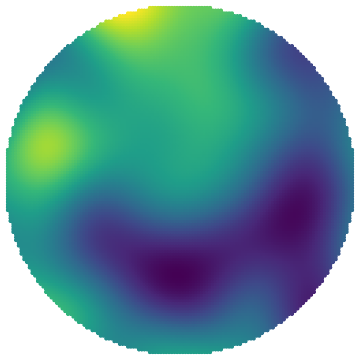</div>
    <div class="coupling-field-card">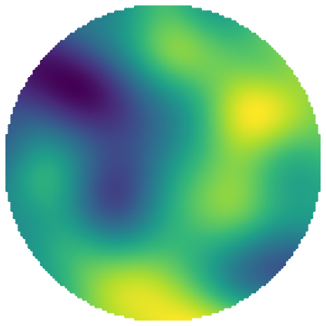</div>
    <div class="coupling-field-card">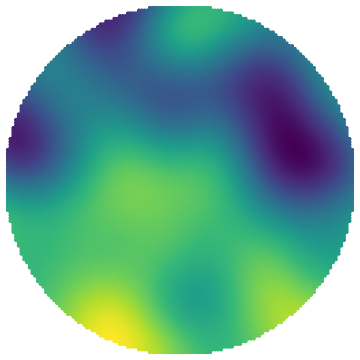</div>
    <div class="coupling-field-card">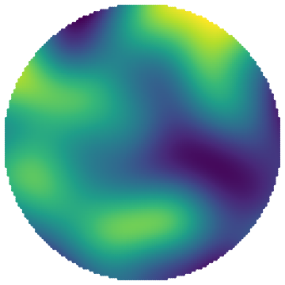</div>
    <div class="coupling-field-card">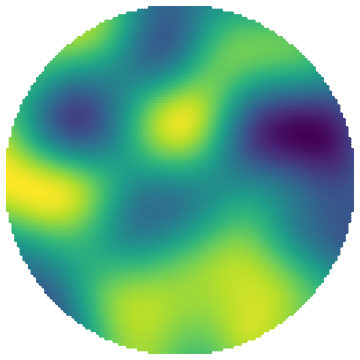</div>

    <div class="coupling-row-label fragment fade-in" data-fragment-index="1"><p>Reference</p></div>
    <div class="coupling-field-card fragment fade-in" data-fragment-index="1">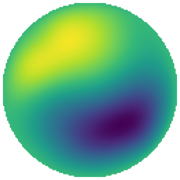</div>
    <div class="coupling-field-card fragment fade-in" data-fragment-index="1">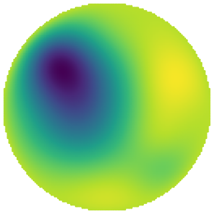</div>
    <div class="coupling-field-card fragment fade-in" data-fragment-index="1">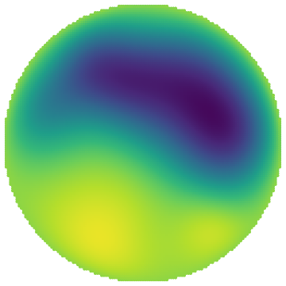</div>
    <div class="coupling-field-card fragment fade-in" data-fragment-index="1"></div>
    <div class="coupling-field-card fragment fade-in" data-fragment-index="1">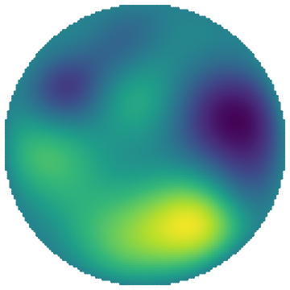</div>

    <div class="coupling-row-label fragment fade-in" data-fragment-index="2"><p>Prediction</p></div>
    <div class="coupling-field-card fragment fade-in" data-fragment-index="2">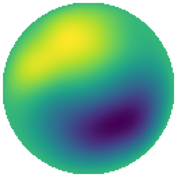</div>
    <div class="coupling-field-card fragment fade-in" data-fragment-index="2">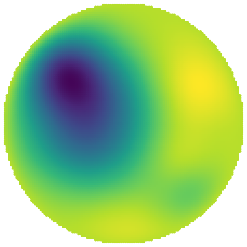</div>
    <div class="coupling-field-card fragment fade-in" data-fragment-index="2">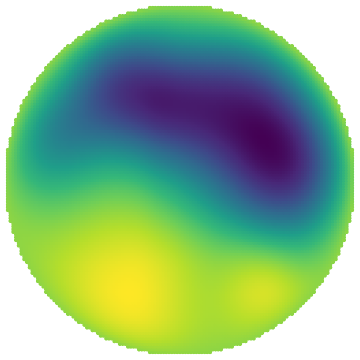</div>
    <div class="coupling-field-card fragment fade-in" data-fragment-index="2">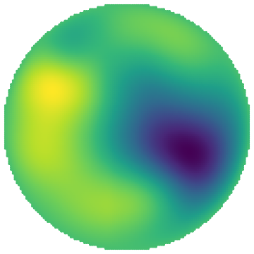</div>
    <div class="coupling-field-card fragment fade-in" data-fragment-index="2">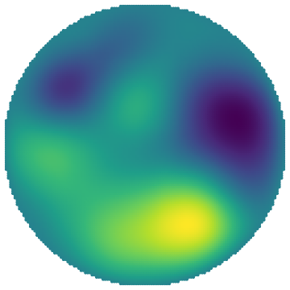</div>

    <div class="coupling-row-label fragment fade-in" data-fragment-index="3"><p>Signed error</p></div>
    <div class="coupling-field-card error fragment fade-in" data-fragment-index="3">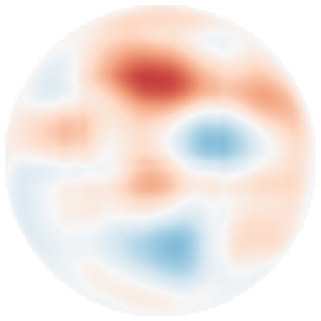</div>
    <div class="coupling-field-card error fragment fade-in" data-fragment-index="3">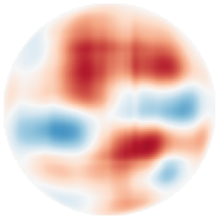</div>
    <div class="coupling-field-card error fragment fade-in" data-fragment-index="3">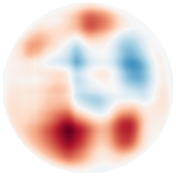</div>
    <div class="coupling-field-card error fragment fade-in" data-fragment-index="3">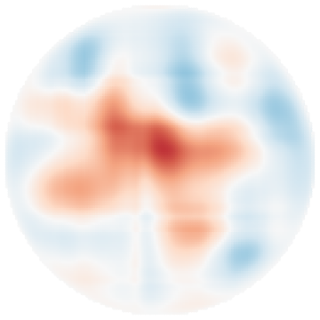</div>
    <div class="coupling-field-card error fragment fade-in" data-fragment-index="3">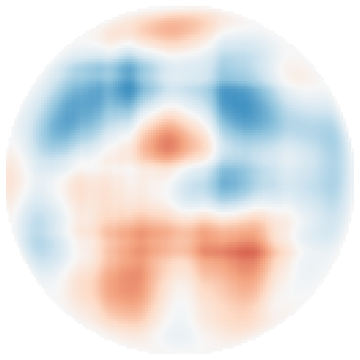</div>
  </div>

  <div class="coupling-metric-card">
    <p class="diagnostic-title">Selected by relative solution error</p>
    <div class="metric-row header"><span>case</span><span>rel. sol. err.</span><span>split energy</span></div>
    <div class="metric-row"><span>min</span><strong>2.33%</strong><strong>3.04e-4</strong></div>
    <div class="metric-row"><span>q25</span><strong>2.74%</strong><strong>5.10e-4</strong></div>
    <div class="metric-row"><span>q50</span><strong>3.32%</strong><strong>4.59e-4</strong></div>
    <div class="metric-row"><span>q75</span><strong>4.32%</strong><strong>2.51e-4</strong></div>
    <div class="metric-row"><span>max</span><strong>6.96%</strong><strong>3.78e-4</strong></div>
    <p class="metric-note">Scales: per-sample source/solution; shared signed-error scale.</p>
  </div>
</div>
```

::: {.evidence-takeaway .fragment data-fragment-index="4"}
Quantile-selected samples show that the learned directional source split supports 2D solution reconstruction across the observed relative-error range, not only on a single favorable case.
:::

::: {.notes}
**Target: 1:15 | Reveal source, reference, prediction, signed error, and takeaway**

This is the complete solver on a convection-diffusion-reaction disk problem. The five columns represent relative-error quantiles, from the minimum to the maximum, rather than one favorable sample.

**Click:** As the reference,

**Click:** prediction,

**Click:** and signed-error rows appear, the predictions follow the reference solutions across this range.

Reference and prediction share a solution scale within each sample, while signed errors use one common zero-centered scale across all five columns.

The metric card reports both relative solution error and split-energy loss. Relative errors range from about 2.3 to 7 percent.

**Click:** These examples show that the learned source split supports reconstruction across the observed test-error distribution.

**If timing is tight:** Quantile-selected cases show reconstruction across the observed error range.

**Transition:** I will close with the four main contributions.
:::

## Takeaway: Coupled Axial Green Solvers

<div class="slide-subtitle">GreenNet learns line-wise Green kernels; CouplingNet learns the directional source split.</div>

<p class="takeaway-thesis">A 2D elliptic problem is solved through axial Green inversions and a learned, balance-preserving source decomposition.</p>

::: {.contribution-grid .takeaway-grid}
::: {.contribution .takeaway-card .fragment}
<p class="label">Axial Green kernels</p>

Normalize axial intervals and learn line-wise inverse kernels.
:::

::: {.contribution .takeaway-card .fragment}
<p class="label">Analytic structure</p>

Encode singular Green behavior before neural correction.
:::

::: {.contribution .takeaway-card .fragment}
<p class="label">Source split</p>

Learn &phi;/&psi; without reference-solution or split labels.
:::

::: {.contribution .takeaway-card .fragment}
<p class="label">Energy bound</p>

Connect unsupervised split consistency to final solution error under assumptions.
:::
:::

::: {.closing-banner .fragment}
<p>GreenNet supplies line-wise Green inverses;<br>CouplingNet learns the source split that turns them into a 2D elliptic solver.</p>
:::

::: {.notes}
**Target: 0:40 | Reveal the thesis, four contribution blocks, and closing banner**

The method has four pieces.

**Click:** Axial Green kernels provide normalized line-wise inverses.

**Click:** Analytic wrapping builds in the singular Green structure.

**Click:** CouplingNet learns a directional source split without solution or split labels, rather than through direct supervision.

**Click:** Split-energy consistency connects that decomposition to final error under explicit assumptions.

**Click:** GreenNet supplies the line-wise inverses, and CouplingNet learns the balance-preserving source split that turns them into a two-dimensional elliptic solver.

Thank you.

**If timing is tight:** GreenNet learns the inverses; CouplingNet learns their balance-preserving coupling.

**Stop here for the timed talk. Use the backup menu only if a question calls for it.**
:::
