## Hybrid Green's Function Learning With Axial Reduction {.title-slide}

<div class="title-kicker">WCCM-ECCOMAS 2026 | MS165 - Methods and Applications of Model Order Reduction</div>

<h1 class="title-main">Hybrid Green's Function Learning<br>With Axial Reduction</h1>

<p class="title-sub">A two-dimensional elliptic solver built from axial Green operators and a learned directional source split</p>

::: {.title-meta}
<p class="presenter">Junhong Jo</p>

<p class="affiliation">National Institute for Mathematical Sciences</p>

<p>Joint work with Taeyoung Ha (NIMS) and Chang-Ock Lee (KAIST)</p>

<p>Tuesday, July 21, 2026</p>
:::

::: {.title-grid}
::: {.title-card}
<p class="label">Reduce</p>

a multi-dimensional elliptic problem into axial Green subproblems
:::

::: {.title-card}
<p class="label">Couple</p>

learn the directional source split that makes axial reconstructions consistent
:::

::: {.title-card}
<p class="label">Recover</p>

a multi-dimensional solution from coupled axial Green operators
:::
:::

::: {.notes}
Open with the full thesis in one sentence after introducing Junhong Jo from the National Institute for Mathematical Sciences and the joint work with Taeyoung Ha from NIMS and Chang-Ock Lee from KAIST.
:::

## Axial Reduction of Elliptic Operators {data-auto-animate=true}

<div class="slide-subtitle">Replace a global source-to-solution map with structured one-dimensional Green reconstructions</div>

::: {.compact-eq}
$$
\begin{aligned}
-\nabla\cdot(a\nabla u)+\mathbf b\cdot\nabla u+cu &= f
&&\text{in }\Omega,\\
u &= 0
&&\text{on }\partial\Omega,
\end{aligned}
\qquad
\mathbf b=(b_x,b_y).
$$
:::

::: {.note-box .strong}
$$
\mathcal S_{a,\mathbf b,c}: f\mapsto u,
\qquad
u=\mathcal S_{a,\mathbf b,c}[f].
$$

<p class="caption-note">Operator fixed; source varies.</p>
:::

::: {.fragment}
::: {.contrast-row}
::: {.problem-card}
<p class="label">Direct map</p>

one global source-to-solution representation

<p class="muted">High-dimensional and geometry-sensitive</p>
:::

::: {.arrow}
→
:::

::: {.problem-card .accent}
<p class="label">Reduced view</p>

directional 1-D operators + learned coupling

<p class="muted">line-wise inverses + learned source split</p>
:::
:::
:::

::: {.fragment}
::: {.split-operators}
$$
L_xu=-\partial_x(a\partial_xu)+b_x\partial_xu+\frac12cu,
\qquad
L_yu=-\partial_y(a\partial_yu)+b_y\partial_yu+\frac12cu.
$$

$$
L_xu+L_yu=f.
$$
:::
:::

::: {.fragment}
::: {.anchor-thesis}
GreenNet supplies line-wise Green inverses; CouplingNet learns the source split that turns them into a 2D elliptic solver.
:::
:::

::: {.notes}
This slide answers two questions: why is axial reduction useful, and what exactly is being reduced? Keep coefficient variation out of the sample narrative; source variation is the sample variation.
:::

## From a 2D Elliptic Problem to Coupled Axial Green Solves

<div class="slide-subtitle">Graphic abstract: slice, solve line-wise, learn the coupling, reconstruct the field</div>

::: {.graphic-abstract-row}
::: {.graphic-stage .ga-problem .ga-compact}
<p class="label">2D forcing problem</p>
<svg class="ga-svg" viewBox="0 0 220 150" role="img" aria-label="Two-dimensional forcing on a general domain">
  <defs>
    <clipPath id="ga-source-domain-clip">
      <path d="M55 28 C84 8, 134 13, 158 39 C186 69, 170 118, 130 127 C88 138, 45 113, 35 78 C25 48, 34 36, 55 28 Z"/>
    </clipPath>
    <radialGradient id="ga-source-heat-a" cx="36%" cy="35%" r="70%">
      <stop offset="0%" stop-color="#fff3cc"/>
      <stop offset="42%" stop-color="#5fbfb7"/>
      <stop offset="100%" stop-color="#0a7c86"/>
    </radialGradient>
  </defs>
  <rect x="25" y="8" width="165" height="130" fill="url(#ga-source-heat-a)" clip-path="url(#ga-source-domain-clip)"/>
  <path d="M55 28 C84 8, 134 13, 158 39 C186 69, 170 118, 130 127 C88 138, 45 113, 35 78 C25 48, 34 36, 55 28 Z" fill="none" stroke="#172026" stroke-width="2.5"/>
  <text x="105" y="70" text-anchor="middle" class="ga-equation">Ω</text>
  <text x="105" y="143" text-anchor="middle">forcing f(x,y)</text>
</svg>
:::

::: {.graphic-arrow .fragment data-fragment-index="1"}
→
:::

::: {.graphic-stage .ga-slices .ga-wide .fragment data-fragment-index="1"}
<p class="label">Axial interval view</p>
<svg class="ga-svg" viewBox="0 0 220 150" role="img" aria-label="Axial intervals inside a general domain">
  <defs>
    <clipPath id="ga-slice-domain-clip">
      <path d="M55 28 C84 8, 134 13, 158 39 C186 69, 170 118, 130 127 C88 138, 45 113, 35 78 C25 48, 34 36, 55 28 Z"/>
    </clipPath>
  </defs>
  <path d="M55 28 C84 8, 134 13, 158 39 C186 69, 170 118, 130 127 C88 138, 45 113, 35 78 C25 48, 34 36, 55 28 Z" fill="#ffffff" stroke="#172026" stroke-width="2.5"/>
  <g clip-path="url(#ga-slice-domain-clip)">
    <line x1="20" y1="48" x2="190" y2="48" stroke="#2374d8" stroke-width="2.3"/>
    <line x1="20" y1="74" x2="190" y2="74" stroke="#2374d8" stroke-width="5"/>
    <line x1="20" y1="101" x2="190" y2="101" stroke="#2374d8" stroke-width="2.3"/>
    <line x1="69" y1="8" x2="69" y2="136" stroke="#d95f49" stroke-width="2.3"/>
    <line x1="104" y1="8" x2="104" y2="136" stroke="#d95f49" stroke-width="5"/>
    <line x1="139" y1="8" x2="139" y2="136" stroke="#d95f49" stroke-width="2.3"/>
  </g>
  <circle cx="104" cy="74" r="4.5" fill="#172026"/>
  <text x="104" y="143" text-anchor="middle" class="ga-small">axial intervals inside Ω</text>
</svg>
:::

::: {.graphic-arrow .fragment data-fragment-index="2"}
→
:::

::: {.graphic-stage .ga-green .fragment data-fragment-index="2"}
<p class="label">GreenNet: line-wise inverse</p>

::: {.ga-math-card .ga-green-math}
::: {.ga-math-kicker}
Kernel integration
:::

$$
v(t)=\int_0^1 G_\theta(t,\eta)\rho(\eta)\,d\eta
$$

::: {.ga-math-caption}
line source profile -> line solution
:::
:::
:::

::: {.graphic-arrow .fragment data-fragment-index="3"}
→
:::

::: {.graphic-stage .ga-solution .ga-wide .fragment data-fragment-index="3"}
<p class="label">CouplingNet: directional coupling</p>

::: {.ga-math-card .ga-coupling-math}
::: {.ga-math-kicker}
Source split couples line-wise inverses
:::

$$
f \xrightarrow{\mathrm{CouplingNet}}(\phi,\psi)
$$

$$
\phi+\psi=f
$$

$$
\phi\xrightarrow{G_x}u_\phi,
\qquad
\psi\xrightarrow{G_y}u_\psi
\Rightarrow u
$$
:::
:::
:::

::: {.fragment data-fragment-index="4"}
::: {.graphic-takeaway}
Axial GreenNet provides line-wise inverses; CouplingNet learns the directional source split that couples them into a 2D solution.
:::
:::

::: {.notes}
Use this as a visual roadmap only. Do not explain GreenNet analytic wrapping, CouplingNet branches, or energy bounds here. The slide should orient the audience: fixed 2D operator and varying source, axial line decomposition, line-wise Green kernels, learned directional source coupling, and 2D reconstruction.
:::

## Unit-Interval Pull-Back and Operator Scaling {data-auto-animate=true}

<div class="slide-subtitle">Physical length is absorbed into normalized operator coefficient profiles and source profile</div>

::: {.two-panel}
::: {}
<p class="panel-title">Physical one-dimensional axial operator</p>

$$
\begin{aligned}
&s\in[s_0,s_1],\\
&\mathcal L_{\mathrm{phys}}u
=
-\frac{d}{ds}
\left(a_{\mathrm{phys}}(s)\frac{du}{ds}\right)
+
b_{\parallel,\mathrm{phys}}(s)\frac{du}{ds}
+
c_{\mathrm{phys}}(s)u
=
f_{\mathrm{phys}}(s).
\end{aligned}
$$
:::

::: {.interval-box}
<p class="panel-title">Normalize the coordinate</p>

::: {.interval-transform}
::: {.interval-stage .physical-stage}
<div class="interval-line">
  <span class="endpoint">s<sub>0</sub></span>
  <span class="track">
    <span class="length-label">L=s<sub>1</sub>-s<sub>0</sub></span>
    <span class="bar"></span>
  </span>
  <span class="endpoint">s<sub>1</sub></span>
</div>
:::

::: {.unit-stage .fragment .fade-up data-fragment-index="1"}
<div class="interval-arrow">pull back</div>
<div class="interval-line unit-interval-line">
  <span class="endpoint">0</span>
  <span class="track"><span class="bar"></span></span>
  <span class="endpoint">1</span>
</div>
:::
:::

::: {.center-eq .fragment .fade-up data-fragment-index="1"}
$$
s=s_0+Lt,\qquad v(t)=u(s_0+Lt),\qquad t\in[0,1].
$$
:::
:::
:::

::: {.fragment data-fragment-index="2"}
::: {.note-box .strong .pullback-length-note}
The interval is normalized, but the physical length is not discarded.
:::
:::

::: {.fragment data-fragment-index="3"}
::: {.equation-card .scaling-card}
$$
a_{\mathrm{unit}}=a_{\mathrm{phys}},
\quad
a'_{\mathrm{unit}}=L a'_{\mathrm{phys}},
\quad
b_{\parallel,\mathrm{unit}}=L b_{\parallel,\mathrm{phys}},
\quad
c_{\mathrm{unit}}=L^2c_{\mathrm{phys}},
\quad
f_{\mathrm{unit}}=L^2f_{\mathrm{phys}}.
$$
:::
:::

::: {.fragment data-fragment-index="4"}
::: {.equation-card .unit-equation-card}
$$
-\frac{d}{dt}
\left(
a_{\mathrm{unit}}(t)\frac{dv}{dt}
\right)
+
b_{\parallel,\mathrm{unit}}(t)\frac{dv}{dt}
+
c_{\mathrm{unit}}(t)v(t)
=
f_{\mathrm{unit}}(t),
\qquad
t\in[0,1].
$$
:::

::: {.small-note .slide3-b-note}
Here $b_\parallel=b_x$ on an $x$-directed interval and $b_\parallel=b_y$ on a $y$-directed interval.
:::
:::

::: {.notes}
Do not re-derive the chain rule. The slide is the bridge: a physical 1D operator on a finite axial interval becomes a normalized unit-interval operator, with length re-entering through coefficient and source scaling.
:::

## GreenNet I: Normalized Axial Green Operator {data-auto-animate=true}

<div class="slide-subtitle">Learn one-dimensional Green kernels, not a global two-dimensional kernel</div>

::: {.inverse-contrast .fragment}
<span>Previous step: normalize the operator.</span>
<strong>This step: learn its Green inverse.</strong>
:::

::: {.operator-action}
::: {.profile-card}
<p class="label">Source profile</p>
<div class="mini-plot source-plot"></div>

$f_{\mathrm{unit}}(\eta)$
:::

::: {.operator-stack}
::: {.operator-symbol}
$G_{\mathrm{unit}}(t,\eta)$
:::
<p class="operator-caption">kernel integral operator</p>
:::

::: {.profile-card}
<p class="label">Solution profile</p>
<div class="mini-plot solution-plot"></div>

$v(t)$
:::
:::

::: {.fragment}
::: {.equation-card}
$$
\mathcal G_{\mathrm{unit}}[f_{\mathrm{unit}}](t)
=
\int_0^1
G_{\mathrm{unit}}(t,\eta)
f_{\mathrm{unit}}(\eta)
\,d\eta,
\qquad
v=\mathcal G_{\mathrm{unit}}[f_{\mathrm{unit}}].
$$
:::
:::

::: {.fragment}
::: {.kernel-note}
**Operator coefficients**: Axial coefficient profiles define each local 1D operator.

**Kernel coordinates** $(t,\eta)$ define the evaluation and source points.

**GreenNet target** is a local unit-interval kernel, not a global 2D Green function.
:::
:::

::: {.notes}
Define Green operator explicitly. The audience should hear that the word Green operator means the integral source-to-solution action, not just a learned matrix.
:::

## GreenNet II: Analytic Green Structure and Learned Correction {data-auto-animate=true}

<div class="slide-subtitle">A hybrid kernel: Dirac delta structure, Heaviside cancellation, and learned smooth correction</div>

::: {.inverse-contrast data-id="singularity-motivation"}
<strong>Do not learn the Green singularity from scratch.</strong>
:::

::: {.hybrid-thesis data-id="hybrid-thesis"}
<p class="label">Hybrid Green kernel</p>

$$
G_\theta
=
\text{Dirac delta structure}
+
\text{Heaviside cancellation}
+
\text{learned smooth correction}.
$$
:::

::: {.role-strip data-id="role-strip"}
::: {.role-pill .analytic}
<p class="label">Dirac delta structure</p>
<p>Build the source jump.</p>
:::

::: {.role-pill .cancel}
<p class="label">Heaviside cancellation</p>
<p>Cancel the induced Heaviside contribution.</p>
:::

::: {.role-pill .learned}
<p class="label">Learned smooth correction</p>
<p>Learn the smooth residual.</p>
:::
:::

::: {.hybrid-takeaway data-id="hybrid-takeaway"}
Analytic structure handles the singular terms before learning.
:::

::: {.notes}
Start with the submitted-abstract motivation: for variable-coefficient operators, Green kernels are rarely available in closed form, and the source-point singularity plus homogeneous boundary constraints are hard for a plain neural network to learn from scratch. The audience should first see the three roles before seeing the full formula.
:::

## GreenNet II: Analytic Green Structure and Learned Correction {data-auto-animate=true}

<div class="slide-subtitle">A hybrid kernel: Dirac delta structure, Heaviside cancellation, and learned smooth correction</div>

::: {.big-equation .hybrid-formula data-id="hybrid-formula"}
$$
G_\theta(t,\eta)
=
\underbrace{\color{#9aa9aa}{E(t,\eta)M(t)R_\theta(t,\eta)}}_{\text{learned smooth correction}}
+
\underbrace{\color{#c9851e}{B(t)\left(J_0(t,\eta)-\frac12E(t,\eta)\right)}}_{\text{Heaviside cancellation}}
+
\underbrace{\color{#0a7c86}{A(t)G_0(t,\eta)}}_{\text{Dirac delta jump}}.
$$
:::

::: {.term-grid .analytic-focus data-id="analytic-terms"}
::: {.term-card .analytic}
<p class="label">Dirac delta structure</p>

$$
G_0(t,\eta)=
\begin{cases}
t(1-\eta), & t<\eta,\\
\eta(1-t), & t\ge\eta,
\end{cases}
\qquad
\partial_t^2G_0=-\delta(t-\eta).
$$
:::

::: {.term-card .cancel}
<p class="label">Heaviside cancellation</p>

$$
\partial_tJ_0(t,\eta)=G_0(t,\eta),
\quad
S=J_0-\frac12E,
\quad
\partial_t^2S=\partial_tG_0.
$$
:::
:::

::: {.hybrid-takeaway data-id="hybrid-takeaway"}
Analytic structure handles the singular terms before learning.
:::

::: {.notes}
Explain only the two built-in analytic mechanisms. A(t)G0 supplies the Dirac delta jump and the corresponding flux-jump behavior. J0 is an antiderivative of G0, so S produces the derivative structure needed for Heaviside cancellation. Keep A and B definitions for Backup A if asked.
:::

## GreenNet II: Analytic Green Structure and Learned Correction {data-auto-animate=true}

<div class="slide-subtitle">A hybrid kernel: Dirac delta structure, Heaviside cancellation, and learned smooth correction</div>

::: {.big-equation .hybrid-formula data-id="hybrid-formula"}
$$
G_\theta(t,\eta)
=
\underbrace{\color{#d85c46}{E(t,\eta)M(t)R_\theta(t,\eta)}}_{\text{learned smooth correction}}
+
\underbrace{\color{#9aa9aa}{B(t)\left(J_0(t,\eta)-\frac12E(t,\eta)\right)}}_{\text{Heaviside cancellation}}
+
\underbrace{\color{#9aa9aa}{A(t)G_0(t,\eta)}}_{\text{Dirac delta jump}}.
$$
:::

::: {.two-panel .learned-focus data-id="learned-focus"}
::: {.term-card .learned}
<p class="label">Learned smooth correction</p>

$$
E(t,\eta)M(t)R_\theta(t,\eta),
\qquad
E(t,\eta)=t\eta(1-\eta),
\qquad
M(t)=1-t.
$$
:::

::: {.note-box .learned-callout}
GreenNet learns $R_\theta$; $E(t,\eta)M(t)$ keeps that correction boundary-compatible. The singular and cancellation terms are already built into the kernel form.
:::
:::

::: {.hybrid-takeaway data-id="hybrid-takeaway"}
The neural network learns the smooth residual with boundary-compatible envelope factors.
:::

::: {.notes}
End this slide by saying that the analytic component supplies the delta-induced jump, flux-jump behavior, and boundary structure before learning. The neural network is not responsible for inventing the Green function singularity; it only learns the smoother residual after the Dirac delta and Heaviside terms are built in.
:::

## GreenNet III: Source-to-Solution Supervision

<div class="slide-subtitle">Supervise the Green operator action, not pointwise exact-kernel labels</div>

::: {.note-box .muted-callout .supervision-contrast}
No pointwise Green-kernel labels.
:::

::: {.supervision-flow}
::: {.flow-node}
$w(t)\sim\mathcal{GP}(0,k_\ell)$
:::

::: {.flow-arrow}
→
:::

::: {.flow-node}
$v(t)=w(t)-((1-t)w(0)+t\,w(1))$

::: {.muted}
so $v(0)=v(1)=0$
:::
:::

::: {.flow-arrow}
→
:::

::: {.flow-node}
$f_{\mathrm{unit}}=\mathcal L_{\mathrm{unit}}v$
:::
:::

::: {.fragment}
::: {.equation-card}
$$
v_\theta(t)
=
\int_0^1
G_\theta(t,\eta)f_{\mathrm{unit}}(\eta)\,d\eta.
$$
:::
:::

::: {.fragment}
::: {.loss-card}
$$
\mathcal J_{\mathrm{Green}}
\sim
\mathbb E
\left[
\int_0^1
\left|v_\theta(t)-v(t)\right|^2\,dt
\right].
$$
:::
:::

::: {.fragment}
::: {.note-box .muted-callout}
Training checks whether the learned Green operator maps sources generated from target solutions back to those target solutions.
:::
:::

::: {.notes}
The important distinction is that the label is not the exact kernel value. GreenNet is supervised by one-dimensional source-to-solution reconstruction pairs: reconstruct a generated target solution from the source generated by applying the unit operator to that target. CouplingNet is different: it is trained without reference-solution or split labels, using balance, Green reconstruction, and split-energy consistency.
:::

## CouplingNet I: Directional Source Split

<div class="slide-subtitle">Learn how the forcing is divided between axial Green reconstructions</div>

::: {.split-question .split-question-compact}
::: {.ghost-inverse}
$G_x[\cdot]$
:::

::: {.question-box}
full source $f$

<p class="big-symbol">?</p>
:::

::: {.ghost-inverse}
$G_y[\cdot]$
:::
:::

::: {.fragment}
::: {.equation-card}
$$
f \longmapsto (\phi,\psi).
$$
:::
:::

::: {.fragment}
::: {.directional-source-definitions}
::: {.split-definition .x-source}
<p class="label">x-directed source</p>

$$
\phi=L_xu,
\qquad
L_xu=
-\partial_x(a\partial_xu)
+b_x\partial_xu
+\tfrac12cu.
$$
:::

::: {.split-definition .y-source}
<p class="label">y-directed source</p>

$$
\psi=L_yu,
\qquad
L_yu=
-\partial_y(a\partial_yu)
+b_y\partial_yu
+\tfrac12cu.
$$
:::
:::
:::

::: {.fragment}
::: {.equation-card .balance-strip}
$$
\phi+\psi=f.
$$
:::
:::

::: {.fragment}
<p class="takeaway-line compact-takeaway">CouplingNet learns line-wise flux-divergence/source components that couple the axial Green reconstructions.</p>
:::

::: {.notes}
This is the transition from GreenNet to CouplingNet. The exact split would use the reference solution, but the slide writes \(u\) to keep notation light. Connect the terminology to the submitted abstract: CouplingNet predicts horizontal and vertical line-wise flux-divergence, or source, components rather than predicting the solution directly. Do not discuss branch internals yet; those belong on Slide 8.
:::

## CouplingNet II: Branches and Local Context for Split Prediction {data-auto-animate=true}

<div class="slide-subtitle">Branch nets encode profiles; trunk nets encode pointwise coordinates</div>

::: {.coupling-architecture}
::: {.arch-group .branch-group .fragment}
<p class="group-label">Branch nets</p>

::: {.arch-card}
<p class="label">Source profile</p>

<p>sample-varying forcing profile</p>
:::

::: {.arch-card}
<p class="label">Coefficient profiles</p>

<p>diffusion, primary/transverse convection, reaction</p>
:::

::: {.arch-card}
<p class="label">Line-geometry structure</p>

<p>interval length, endpoints, transverse placement</p>
:::
:::

::: {.arch-center}
<p class="predictor-label">Split predictor</p>

$$
(\text{branch features},\ \text{trunk features})
\longrightarrow
(\phi,\psi)
$$
:::

::: {.arch-group .trunk-group .fragment}
<p class="group-label">Trunk nets</p>

::: {.arch-card}
<p class="label">Axial local trunk</p>

$t_{\parallel}$: position along the primary interval
:::

::: {.arch-card}
<p class="label">Pointwise transverse trunk</p>

$t_{\perp}$: position on the transverse interval through this point
:::
:::
:::

::: {.fragment}
::: {.architecture-takeaway}
$$
\underbrace{\text{profiles and line geometry}}_{\text{branch nets}}
\quad+\quad
\underbrace{\text{pointwise coordinates}}_{\text{trunk nets}}
\quad\Rightarrow\quad
\text{directional source split}.
$$
:::
:::

::: {.notes}
Keep the slide conceptual: multiple branch nets process source, coefficient profiles, and line-geometry structure, while trunk nets process pointwise coordinates. Avoid the phrase "fixed operator context" on the visible slide. The coefficient field is fixed for the problem, but its axial profiles vary from line to line; the same operator-learning model is reused across lines. Emphasize why pointwise transverse information belongs in a trunk: it is coordinate-dependent.
:::

## CouplingNet III: Projection and Green Reconstruction {data-auto-animate=true}

<div class="slide-subtitle">Project in physical split variables, then reconstruct and average</div>

::: {.solver-pipeline}
::: {.projection-stage}
<p class="stage-label">Stage 1: physical balance projection</p>

::: {.stage-flow}
::: {.solver-card .raw-card .fragment data-fragment-index="1"}
<p class="label">CouplingNet raw split</p>

$$
(\phi_{\mathrm{raw}},\psi_{\mathrm{raw}})
$$

<p>not guaranteed balanced</p>
:::

::: {.solver-arrow .fragment data-fragment-index="2"}
→
:::

::: {.solver-card .projection-card .fragment data-fragment-index="2"}
<p class="label">Projection step</p>

$$
r=f-(\phi_{\mathrm{raw}}+\psi_{\mathrm{raw}})
$$

$$
\phi=\phi_{\mathrm{raw}}+\frac12r,
\qquad
\psi=\psi_{\mathrm{raw}}+\frac12r
$$
:::

::: {.solver-arrow .fragment data-fragment-index="3"}
→
:::

::: {.solver-card .balanced-card .fragment data-fragment-index="3"}
<p class="label">Balanced split</p>

$$
\phi+\psi=f
$$
:::
:::
:::

::: {.reconstruction-stage .fragment data-fragment-index="4"}
<p class="stage-label">Stage 2: Green reconstruction</p>

::: {.reconstruction-grid}
::: {.solver-card}
<p class="label">x-represented solution</p>

$$
u_\phi=G_x[\phi]
$$
:::

::: {.solver-card}
<p class="label">y-represented solution</p>

$$
u_\psi=G_y[\psi]
$$
:::

::: {.solver-card .final-average-card}
<p class="label">Final average</p>

$$
u_{\mathrm{pred}}=\frac12(u_\phi+u_\psi)
$$
:::
:::
:::

::: {.fragment data-fragment-index="5"}
::: {.solver-takeaway}
$$
(\phi_{\mathrm{raw}},\psi_{\mathrm{raw}})
\xrightarrow{\text{projection}}
(\phi,\psi),\ \phi+\psi=f
\xrightarrow{G_x,G_y}
(u_\phi,u_\psi)
\xrightarrow{\text{average}}
u_{\mathrm{pred}}.
$$
:::
:::
:::

::: {.notes}
Say explicitly that projection is applied to physical split variables, not unit-interval quantities. The raw split is not guaranteed balanced; the projection enforces \(\phi+\psi=f\) by distributing the residual symmetrically before the two Green reconstructions are averaged.
:::

## Energy-Norm Error Bound Proposition

<div class="slide-subtitle">Small split energy controls the final energy error</div>

::: {.energy-diagram}
::: {.solution-node}
$u_\phi$
:::

::: {.solution-node .focus}
$u_{\mathrm{pred}}=\frac12(u_\phi+u_\psi)$
:::

::: {.solution-node}
$u_\psi$
:::
:::

::: {.fragment data-fragment-index="1"}
::: {.equation-card .energy-norm-card}
<p class="label">Diffusion-weighted energy norm</p>

$$
\|v\|_a^2
:=
\int_\Omega a(x)|\nabla v(x)|^2\,dx,
\qquad
a(x)>0.
$$

::: {.mini-note}
Here $a(x)$ is the diffusion coefficient.
:::
:::
:::

::: {.energy-definition-grid}
::: {.fragment data-fragment-index="2"}
::: {.equation-card .split-energy-card}
<p class="label">Split-energy loss</p>

$$
\mathcal{E}_{\mathrm{split}}=\|u_\phi-u_\psi\|_a^2.
$$
:::
:::

::: {.fragment data-fragment-index="3"}
::: {.equation-card .reference-card}
<p class="label">Reference solution</p>

$$
\mathcal L u_*=f,
\qquad
u_*|_{\partial\Omega}=0.
$$
:::
:::
:::

::: {.fragment data-fragment-index="4"}
::: {.bound-card .energy-bound-card}
$$
\|u_{\mathrm{pred}}-u_*\|_a
\le
\frac{C_E}{2}
\sqrt{\mathcal{E}_{\mathrm{split}}}.
$$

::: {.constant-note}
$C_E$: stability constant of the fixed elliptic operator.
:::
:::
:::

::: {.assumption-footer .energy-assumption-strip .fragment data-fragment-index="5"}
Conditional on exact/controlled Green reconstruction and $H_0^1(\Omega)$-admissible represented solutions.
:::

::: {.notes}
Reveal the definitions before the bound: \(a(x)\) is the diffusion coefficient, \(u_*\) is the reference PDE solution, and \(C_E\) is a stability constant of the fixed elliptic operator. State the claim clearly but conditionally. Do not put proof variables on the main slide. Mention learned Green errors as perturbation terms if there is time.
:::

## Numerical Evidence I: GreenNet Kernel Approximation

<div class="slide-subtitle">Capturing the singular Green structure on an axial interval</div>

::: {.evidence-label .kernel-label}
Kernel-level evidence
:::

::: {.evidence-problem-strip}
$$
\Omega=\{x^2+y^2<0.5^2\},\qquad
-\nabla\cdot(a\nabla u)=f,\qquad
a(x,y)=1+\frac12\sin(2\pi x)\sin(4\pi y),\qquad
\mathbf b=0,\ c=0.
$$
:::

```{=html}
<div class="greennet-evidence-grid">
  <div class="greennet-evidence-card fragment" data-fragment-index="1">
    <p class="plot-card-title">Reference kernel</p>
    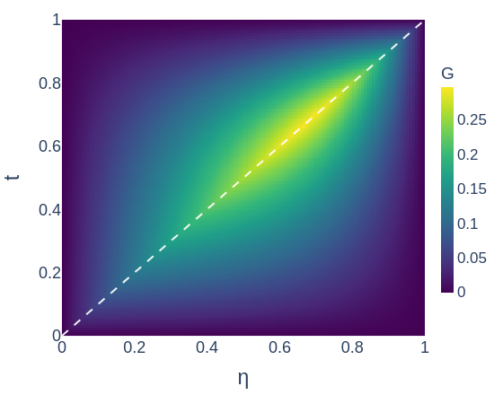
  </div>
  <div class="greennet-evidence-card fragment" data-fragment-index="2">
    <p class="plot-card-title">Learned kernel</p>
    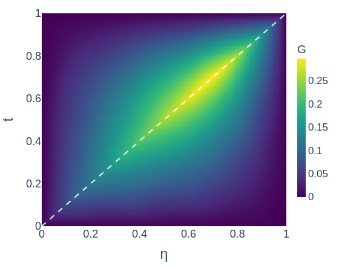
  </div>
  <div class="greennet-evidence-card fragment" data-fragment-index="3">
    <p class="plot-card-title">Signed error</p>
    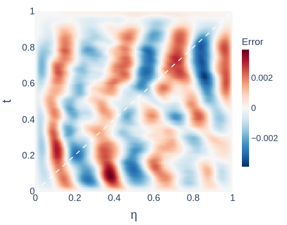
  </div>
  <div class="greennet-evidence-card slice-card fragment" data-fragment-index="4">
    <p class="plot-card-title">Fixed-<span class="keep-case">η</span> slice</p>
    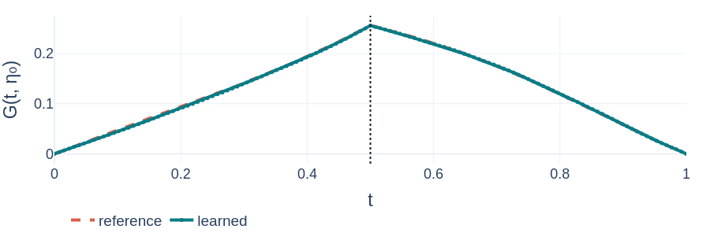
  </div>
  <div class="greennet-diagnostic-card fragment" data-fragment-index="5">
    <p class="diagnostic-title">Diagnostics</p>
    <div class="diagnostic-row"><span>η</span><strong>0.50</strong></div>
    <div class="diagnostic-row"><span>Kernel rel. L2</span><strong>1.11%</strong></div>
    <div class="diagnostic-row"><span>Slice rel. L2</span><strong>0.92%</strong></div>
    <div class="diagnostic-row"><span>Diagonal band</span><strong>|t-η| ≤ 5/128 = 0.0391</strong></div>
    <div class="diagnostic-row"><span>Error mass / band area</span><strong>9.5% / 8.3%</strong></div>
    <div class="diagnostic-row"><span>Mean error / off-band mean</span><strong>1.16x</strong></div>
  </div>
</div>
```

::: {.evidence-takeaway .greennet-takeaway .fragment}
The learned kernel captures the singular Green structure, and the signed error is not concentrated near the singular diagonal.
:::

::: {.notes}
Use this as GreenNet-only evidence before the full CouplingNet solution slide. Point first to the reference and learned kernels, then to the signed error, and finally to the fixed-η slice. The diagnostic table gives the exact values used for the slide claim: kernel relative L2 about 1.11%, slice relative L2 about 0.92%, and diagonal-band error mass close to the diagonal-band area.
:::

## Numerical Evidence II: CouplingNet Solution Reconstruction

<div class="slide-subtitle">Quantile-selected samples show source, reference, prediction, and signed error</div>

::: {.evidence-label .solver-label}
Solver-level evidence
:::

::: {.evidence-problem-strip .coupling-problem-strip}
$$
\Omega=\{x^2+y^2<0.5^2\},\qquad
-\nabla\cdot(a\nabla u)=f,\qquad
a(x,y)=1+\frac12\sin(2\pi x)\sin(4\pi y),\qquad
\mathbf b=0,\ c=0.
$$
:::

```{=html}
<div class="coupling-evidence-layout">
  <div class="coupling-evidence-grid" aria-label="CouplingNet field comparison across rel. solution error quantiles.">
    <div></div>
    <div class="coupling-col-label"><p>min</p><span>rel. sol. err.</span></div>
    <div class="coupling-col-label"><p>q25</p><span>rel. sol. err.</span></div>
    <div class="coupling-col-label"><p>q50</p><span>rel. sol. err.</span></div>
    <div class="coupling-col-label"><p>q75</p><span>rel. sol. err.</span></div>
    <div class="coupling-col-label"><p>max</p><span>rel. sol. err.</span></div>

    <div class="coupling-row-label"><p>Source</p></div>
    <div class="coupling-field-card">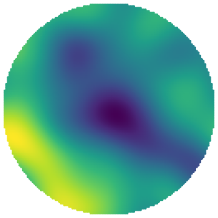</div>
    <div class="coupling-field-card">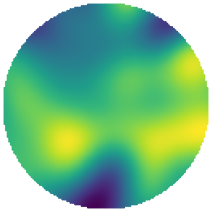</div>
    <div class="coupling-field-card">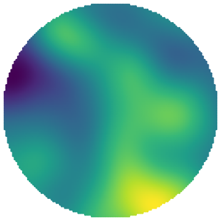</div>
    <div class="coupling-field-card">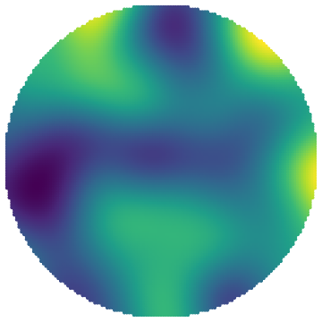</div>
    <div class="coupling-field-card">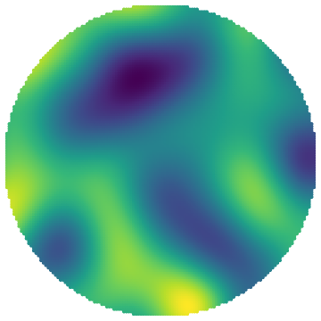</div>

    <div class="coupling-row-label fragment fade-in" data-fragment-index="1"><p>Reference</p></div>
    <div class="coupling-field-card fragment fade-in" data-fragment-index="1"></div>
    <div class="coupling-field-card fragment fade-in" data-fragment-index="1">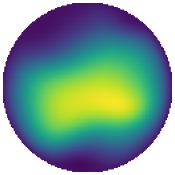</div>
    <div class="coupling-field-card fragment fade-in" data-fragment-index="1">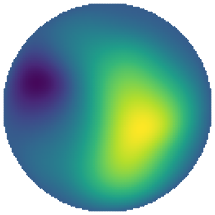</div>
    <div class="coupling-field-card fragment fade-in" data-fragment-index="1"></div>
    <div class="coupling-field-card fragment fade-in" data-fragment-index="1">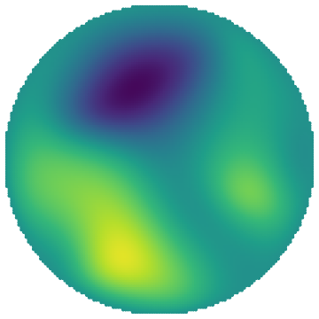</div>

    <div class="coupling-row-label fragment fade-in" data-fragment-index="2"><p>Prediction</p></div>
    <div class="coupling-field-card fragment fade-in" data-fragment-index="2">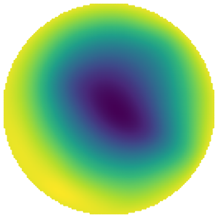</div>
    <div class="coupling-field-card fragment fade-in" data-fragment-index="2">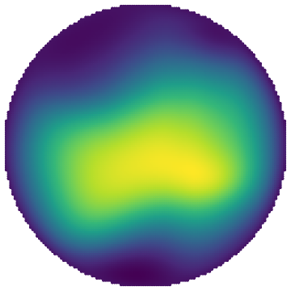</div>
    <div class="coupling-field-card fragment fade-in" data-fragment-index="2">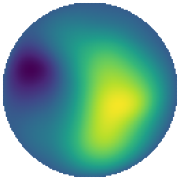</div>
    <div class="coupling-field-card fragment fade-in" data-fragment-index="2">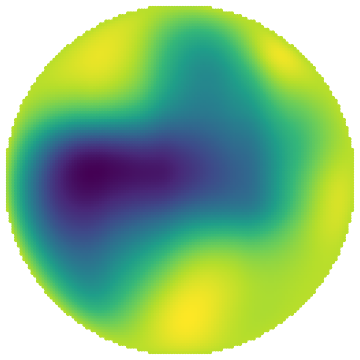</div>
    <div class="coupling-field-card fragment fade-in" data-fragment-index="2">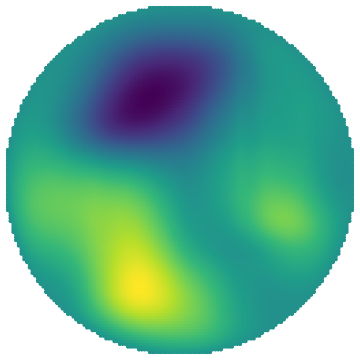</div>

    <div class="coupling-row-label fragment fade-in" data-fragment-index="3"><p>Signed error</p></div>
    <div class="coupling-field-card error fragment fade-in" data-fragment-index="3">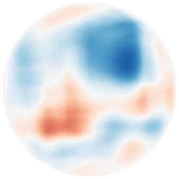</div>
    <div class="coupling-field-card error fragment fade-in" data-fragment-index="3">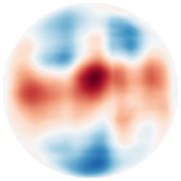</div>
    <div class="coupling-field-card error fragment fade-in" data-fragment-index="3">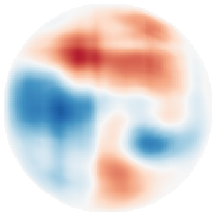</div>
    <div class="coupling-field-card error fragment fade-in" data-fragment-index="3">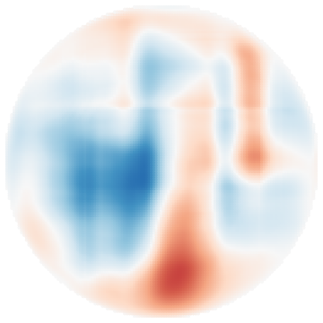</div>
    <div class="coupling-field-card error fragment fade-in" data-fragment-index="3">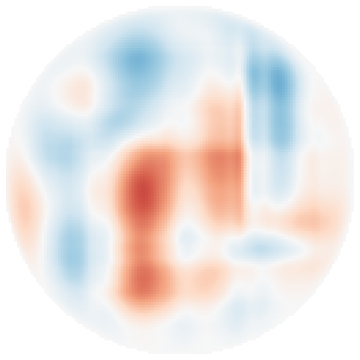</div>
  </div>

  <div class="coupling-metric-card">
    <p class="diagnostic-title">Selected by relative solution error</p>
    <div class="metric-row header"><span>case</span><span>rel. sol. err.</span><span>split energy</span></div>
    <div class="metric-row"><span>min</span><strong>1.87%</strong><strong>7.48e-4</strong></div>
    <div class="metric-row"><span>q25</span><strong>3.10%</strong><strong>8.59e-4</strong></div>
    <div class="metric-row"><span>q50</span><strong>3.95%</strong><strong>7.41e-4</strong></div>
    <div class="metric-row"><span>q75</span><strong>5.33%</strong><strong>6.87e-4</strong></div>
    <div class="metric-row"><span>max</span><strong>8.84%</strong><strong>4.77e-4</strong></div>
    <p class="metric-note">Scales: per-sample source/solution; shared signed-error scale.</p>
  </div>
</div>
```

::: {.evidence-takeaway .fragment data-fragment-index="4"}
Quantile-selected samples show that the learned directional source split supports 2D solution reconstruction across the observed relative-error range, not only on a single favorable case.
:::

::: {.notes}
Columns are selected by relative solution error quantiles: min, q25, q50, q75, and max.  The source row is visible first; reference, prediction, and signed-error rows reveal one row at a time.  The panels are intentionally title-free and axis-free; row and column labels live in the slide so the fields stay readable.  Source fields use per-sample scales.  Within each column, reference and prediction share one solution scale, while different columns use independent solution scales.  The signed-error row uses one zero-centered diverging scale across the selected samples, preserving error-magnitude comparison.  The metric card is visible from the start and labels the column quantity as relative solution error.
:::

## Takeaway: Coupled Axial Green Solvers

<div class="slide-subtitle">GreenNet learns line-wise Green kernels; CouplingNet learns the directional source split.</div>

<p class="takeaway-thesis">A 2D elliptic problem is solved through axial Green inversions and a learned, balance-preserving source decomposition.</p>

::: {.contribution-grid .takeaway-grid}
::: {.contribution .takeaway-card .fragment}
<p class="label">Axial Green kernels</p>

Normalize axial intervals and learn line-wise inverse kernels.
:::

::: {.contribution .takeaway-card .fragment}
<p class="label">Analytic structure</p>

Encode singular Green behavior before neural correction.
:::

::: {.contribution .takeaway-card .fragment}
<p class="label">Source split</p>

Learn &phi;/&psi; without reference-solution or split labels.
:::

::: {.contribution .takeaway-card .fragment}
<p class="label">Energy bound</p>

Connect unsupervised split consistency to final solution error under assumptions.
:::
:::

::: {.closing-banner .fragment}
<p>GreenNet supplies line-wise Green inverses;<br>CouplingNet learns the source split that turns them into a 2D elliptic solver.</p>
:::

::: {.notes}
End with the solver decomposition, not implementation. The reference solution is not used to train CouplingNet; reference solutions are used only for evaluation. CouplingNet is trained through balance, Green reconstruction, and split consistency. More precisely, the CouplingNet optimization loss is split-energy consistency after projection and Green reconstruction.
:::

## Backup / Q&A Menu

<div class="slide-subtitle">Details available if the audience asks</div>

::: {.backup-menu}
::: {.menu-col}
<p class="label">Ready without figures</p>

- Backup A: Dirac/Heaviside derivation sketch
- Backup B: imperfect Green reconstruction perturbation
- Backup C: connected-interval pull-back detail
:::

::: {.menu-col .deferred}
<p class="label">Deferred until figures are selected</p>

- extra GreenNet reconstruction evidence
- extra CouplingNet split/energy evidence
:::
:::

::: {.notes}
Do not present this during the timed talk unless asked. It is a menu for Q&A.
:::

## Backup A: Dirac/Heaviside Derivation Sketch

<div class="slide-subtitle">Why the analytic Green wrapping has three terms</div>

::: {.backup-heading}
Operator application creates two effects.
:::

::: {.big-equation .small-math}
$$
G_\theta
=
E M R_\theta
+
B\left(J_0-\frac12E\right)
+
A G_0.
$$
:::

::: {.backup-grid .operator-effects}
::: {.term-card .analytic}
<p class="label">Effect 1: Dirac jump</p>

$$
\partial_t^2G_0(t,\eta)=-\delta(t-\eta)
$$

The base term \(A(t)G_0(t,\eta)\) provides the required source singularity.
:::

::: {.term-card .cancel}
<p class="label">Effect 2: Heaviside leftover</p>

$$
\partial_tJ_0(t,\eta)=G_0(t,\eta)
$$

Applying the operator to the jump structure also creates a Heaviside-type contribution.
:::

::: {.term-card .learned}
<p class="label">Analytic compensation</p>

$$
S=J_0-\frac12E,\qquad \partial_t^2S=\partial_tG_0
$$

\(B(t)S(t,\eta)\) cancels the Heaviside contribution before the neural correction is used.
:::
:::

::: {.coefficient-strip}
$$
A(t)=\frac{1}{a_{\mathrm{unit}}(t)},
\qquad
B(t)=
\frac{a'_{\mathrm{unit}}(t)+b_{\parallel,\mathrm{unit}}(t)}
{a_{\mathrm{unit}}(t)^2}.
$$

The neural term \(E(t,\eta)M(t)R_\theta(t,\eta)\) learns the remaining smooth residual.
:::

::: {.notes}
Use this only if someone asks why the analytic wrapping is built this way.
:::

## Backup B: Imperfect Green Reconstruction Perturbation

<div class="slide-subtitle">What changes when the learned Green inverse is not exact?</div>

$$
G_x[\phi_*]=u_*+\varepsilon_x,
\qquad
G_y[\psi_*]=u_*+\varepsilon_y.
$$

::: {.bound-card}
$$
\|u_{\mathrm{pred}}-u_*\|_a
\le
\frac{C_E}{2}
\left(
\sqrt{\mathcal{E}_{\mathrm{split}}}
+
\|\varepsilon_x-\varepsilon_y\|_a
\right)
+
\frac12\|\varepsilon_x+\varepsilon_y\|_a.
$$
:::

::: {.perturbation-channels}
::: {.channel-card .mismatch-channel}
<p class="label">Directional mismatch</p>

$$
\varepsilon_x-\varepsilon_y
$$

Visible to the split-consistency argument.
:::

::: {.channel-card .bias-channel}
<p class="label">Common bias</p>

$$
\varepsilon_x+\varepsilon_y
$$

Can remain invisible when the two reconstructions agree.
:::
:::

::: {.notes}
This is the honest limitation slide. Energy consistency is meaningful, but GreenNet accuracy remains part of the error story.
:::

## Backup C: Connected-Interval Pull-Back Detail

<div class="slide-subtitle">How non-square domains become normalized one-dimensional Green problems</div>

::: {.geometry-backup-layout}
::: {.domain-slice-card}
<p class="panel-title">One axial slice can produce multiple connected intervals</p>

<svg class="connected-slice-svg" viewBox="0 0 480 240" role="img" aria-label="Non-square domain slice with disconnected connected intervals">
  <defs>
    <marker id="backup-arrowhead" markerWidth="10" markerHeight="8" refX="9" refY="4" orient="auto">
      <path d="M0,0 L10,4 L0,8 Z" fill="#c9851e"/>
    </marker>
    <clipPath id="backup-domain-clip">
      <path d="M62 42 C112 10, 205 21, 247 60 C293 103, 263 166, 205 181 C147 197, 68 167, 39 111 C18 72, 29 54, 62 42 Z"/>
    </clipPath>
  </defs>
  <path d="M62 42 C112 10, 205 21, 247 60 C293 103, 263 166, 205 181 C147 197, 68 167, 39 111 C18 72, 29 54, 62 42 Z" fill="#ffffff" stroke="#172026" stroke-width="4"/>
  <ellipse cx="151" cy="104" rx="36" ry="52" fill="#f7f8f4" stroke="#d95f49" stroke-width="4"/>
  <line x1="20" y1="104" x2="295" y2="104" stroke="#d7dedc" stroke-width="4"/>
  <g clip-path="url(#backup-domain-clip)">
    <line x1="38" y1="104" x2="113" y2="104" stroke="#0a7c86" stroke-width="9" stroke-linecap="round"/>
    <line x1="188" y1="104" x2="265" y2="104" stroke="#0a7c86" stroke-width="9" stroke-linecap="round"/>
  </g>
  <text x="76" y="92">I_1</text>
  <text x="218" y="92">I_2</text>
  <text x="153" y="170" class="slice-warning">outside domain gap</text>
  <text x="338" y="80" class="slice-note">independent</text>
  <text x="338" y="108" class="slice-note">1D Green</text>
  <text x="338" y="136" class="slice-note">problems</text>
  <path d="M282 104 C316 104, 318 104, 332 104" fill="none" stroke="#c9851e" stroke-width="4" marker-end="url(#backup-arrowhead)"/>
</svg>
:::

::: {.interval-box}
<p class="panel-title">Pull back each connected interval separately</p>

$$
I=[s_0,s_1],
\qquad
s=s_0+Lt,
\qquad
t\in[0,1].
$$
:::

::: {.equation-card}
$$
a_{\mathrm{unit}}=a_{\mathrm{phys}},
\quad
a'_{\mathrm{unit}}=L a'_{\mathrm{phys}},
\quad
b_{\parallel,\mathrm{unit}}=L b_{\parallel,\mathrm{phys}},
\quad
c_{\mathrm{unit}}=L^2c_{\mathrm{phys}},
\quad
f_{\mathrm{unit}}=L^2f_{\mathrm{phys}}.
$$
:::
:::

::: {.note-box}
Each connected interval is an independent one-dimensional Dirichlet Green problem.

Connected intervals are not merged across outside-domain gaps, because that would create artificial information flow outside the domain.
:::

::: {.notes}
Use this only for geometry questions. Do not discuss geometry generation or file formats.
:::
